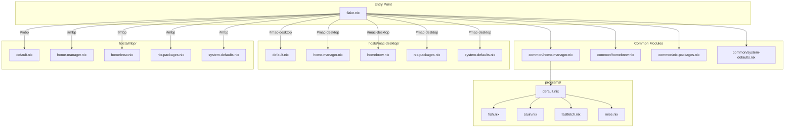
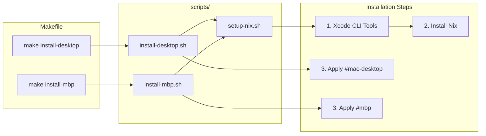
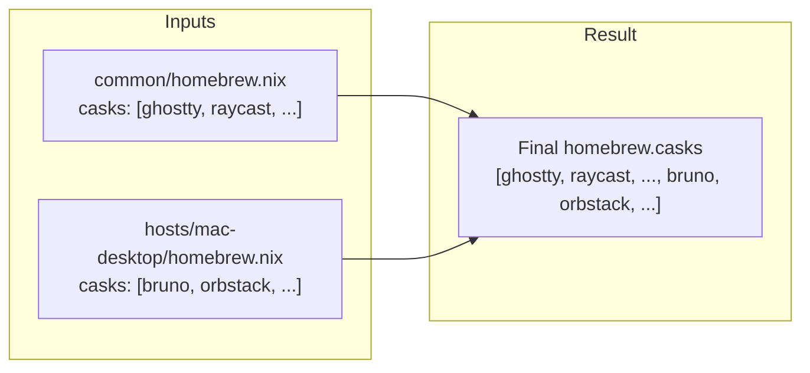
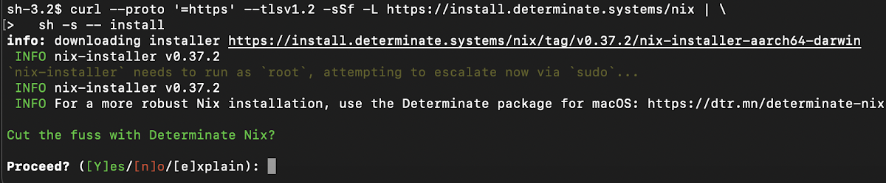

# Nix Config

Personal Nix configuration for managing system packages, dev environment, and dotfiles on macOS.

> For a more advanced nix config, check out [github.com/r17x/universe](https://github.com/r17x/universe)

## Architecture

### Directory Structure

```
nix-config/
├── flake.nix                     # Entry point
├── Makefile                      # Build commands
├── common/                       # Shared configurations
│   ├── home-manager.nix
│   ├── homebrew.nix
│   ├── nix-packages.nix
│   └── system-defaults.nix
├── hosts/                        # Machine-specific configurations
│   ├── mac-desktop/
│   │   ├── default.nix
│   │   ├── home-manager.nix
│   │   ├── homebrew.nix
│   │   ├── nix-packages.nix
│   │   └── system-defaults.nix
│   └── mbp/
│       └── ... (same structure)
├── programs/                     # Shared program configs (fish, atuin, etc.)
├── app-config/
│   ├── common/                   # Shared app configs
│   └── hosts/                    # Machine-specific app configs
├── scripts/                      # Installation scripts
└── shells/                       # Development shells
```

### Configuration Flow



### App Config Flow

```mermaid
flowchart TB
    subgraph CommonHM["common/home-manager.nix"]
        chm_files["home.file"]
    end

    subgraph DesktopHM["hosts/mac-desktop/home-manager.nix"]
        dhm_files["home.file"]
    end

    subgraph MBPHM["hosts/mbp/home-manager.nix"]
        mhm_files["home.file"]
    end

    subgraph CommonConfig["app-config/common/"]
        ac_ghostty["ghostty/config"]
        ac_wezterm["wezterm/wezterm.lua"]
        ac_git["git/.gitconfig-personal<br/>git/.gitconfig-alami-group<br/>git/.gitignore"]
        ac_karabiner["karabiner/karabiner.json"]
        ac_mise["mise/config.toml"]
        ac_ssh["ssh/config<br/>ssh/id_github_personal.pub"]
    end

    subgraph DesktopConfig["app-config/hosts/mac-desktop/"]
        ad_git["git/.gitconfig"]
        ad_flash["flashspace/profiles.json<br/>flashspace/settings.json"]
        ad_hammer["hammerflow/home.toml<br/>hammerflow/init.lua"]
        ad_sftpgo["sftpgo/config.nix"]
    end

    subgraph MBPConfig["app-config/hosts/mbp/"]
        am_git["git/.gitconfig"]
        am_flash["flashspace/profiles.json<br/>flashspace/settings.json"]
        am_hammer["hammerflow/home.toml<br/>hammerflow/init.lua"]
    end

    chm_files --> ac_ghostty & ac_wezterm & ac_git & ac_karabiner & ac_mise & ac_ssh
    dhm_files --> ad_git & ad_flash & ad_hammer & ad_sftpgo
    mhm_files --> am_git & am_flash & am_hammer
```



### Installation Flow



### Module Merging

Common and host-specific modules are **merged** (not sequential):



## Prerequisite

1. **Login to Mac App Store** - Required to install packages using `mas`

2. **Add Full Disk Access to Terminal** - Go to `System Settings > Privacy & Security > Full Disk Access` and add your terminal app

## Installation

```sh
# 1. Create nix folder
mkdir ~/nix && cd ~/nix

# 2. Clone repo
git clone <repo-url> nix-config
cd nix-config

# 3. Run installation
make install-desktop  # For Mac Desktop
# or
make install-mbp      # For MacBook Pro
```

> **Note:** When prompted about `Determinate` package, press `n` to skip.
>
> 

After installation, restart your terminal to use fish shell.

## Usage

```sh
# Fish abbreviations (recommended for daily use)
nixmd                 # Rebuild Mac Desktop
nixmbp                # Rebuild MacBook Pro

# Or use Makefile
make switch-desktop   # Rebuild Mac Desktop
make switch-mbp       # Rebuild MacBook Pro
make update           # Update flake inputs
make check            # Check configuration
make clean            # Garbage collection
make help             # Show all commands
```

## Maintenance

```sh
# View all generations
darwin-rebuild --list-generations

# Clean up older than 7 days
nix-collect-garbage --delete-older-than 7d
sudo nix-collect-garbage --delete-older-than 7d

# Clean up all (or use: make clean)
nix-collect-garbage -d
sudo nix-collect-garbage -d
```

## Reference

- [github.com/r17x/universe](https://github.com/r17x/universe)
- [github.com/torgeir/nix-darwin](https://github.com/torgeir/nix-darwin)
- [github.com/linkarzu/dotfiles-latest](https://github.com/linkarzu/dotfiles-latest)

## To Do

- Put private key in this repo (encrypt/decrypt automatically)
- Use [nixos-unified](https://nixos-unified.org/index.html) to unify nix-darwin + home-manager
