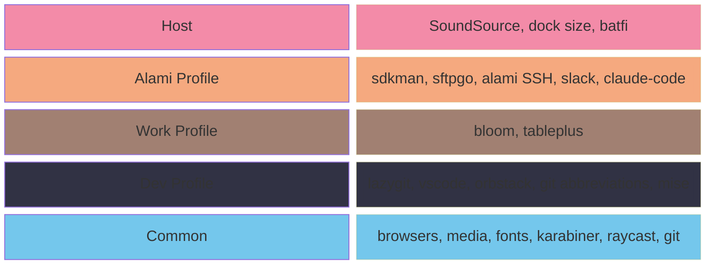
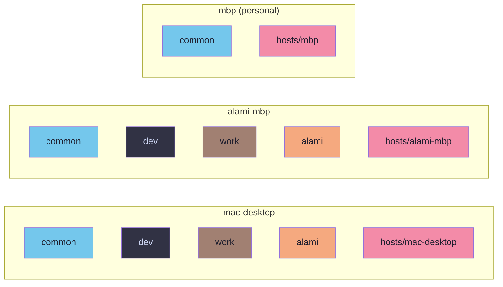
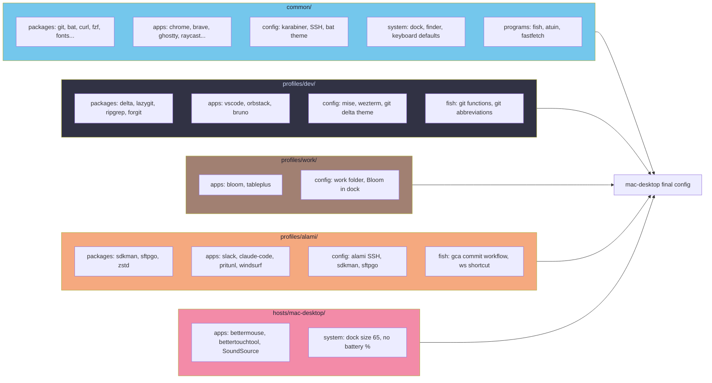
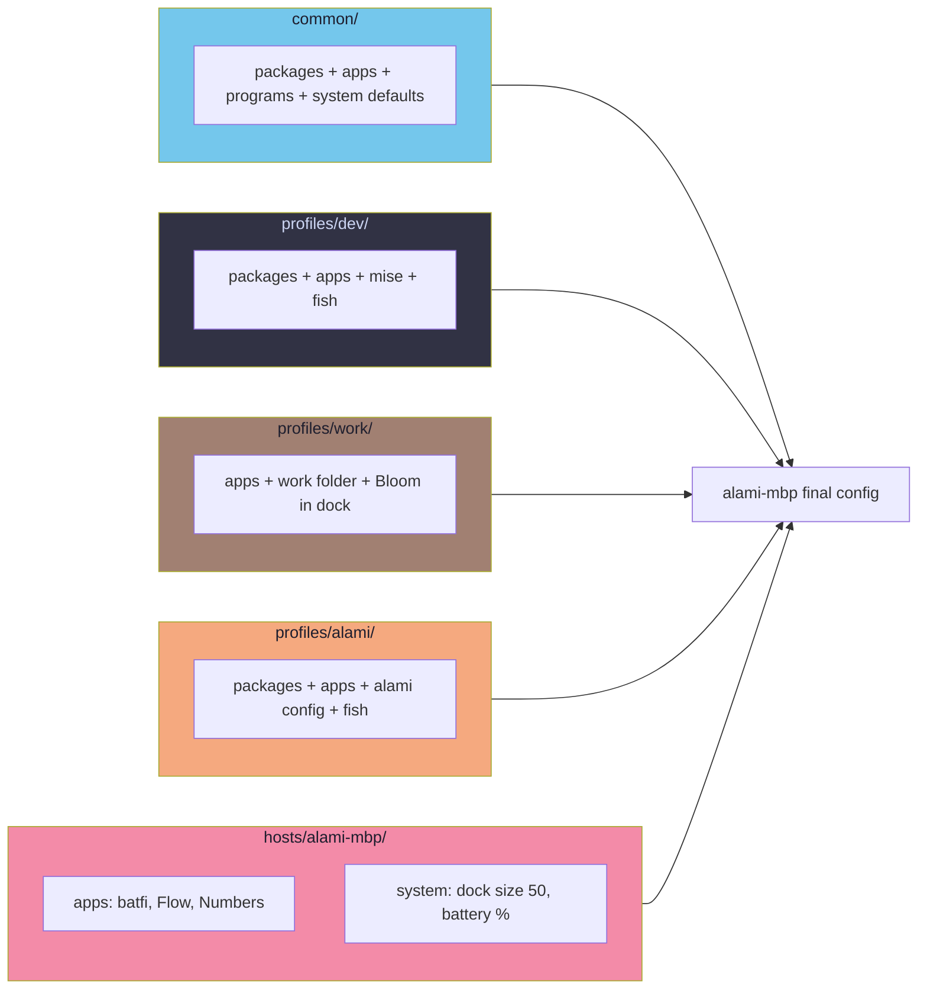
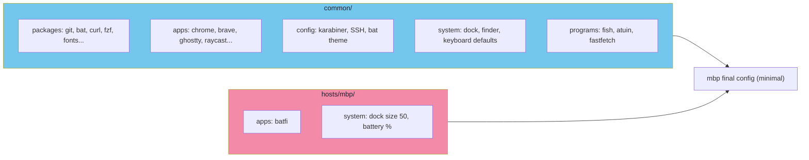
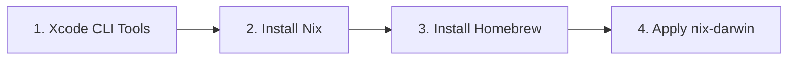

# Nix Config

Personal Nix configuration for managing system packages, dev environment, and dotfiles on macOS.

> For a more advanced nix config, check out [github.com/r17x/universe](https://github.com/r17x/universe)

## Architecture

### How It Works

Configuration is built from **layers that merge together**:


```mermaid
block-beta
    columns 2
    lbl5["Host"]:1
    block:layer5["hosts/{machine}/"]:1
        l5["SoundSource, dock size, batfi"]
    end
    lbl4["Alami Profile"]:1
    block:layer4["profiles/alami/"]:1
        l4["sdkman, sftpgo, alami SSH, slack, claude-code"]
    end
    lbl3["Work Profile"]:1
    block:layer3["profiles/work/"]:1
        l3["bloom, tableplus"]
    end
    lbl2["Dev Profile"]:1
    block:layer2["profiles/dev/"]:1
        l2["lazygit, vscode, orbstack, git abbreviations, mise"]
    end
    lbl1["Common"]:1
    block:layer1["common/"]:1
        l1["browsers, media, fonts, karabiner, raycast, git"]
    end

    style lbl1 fill:#74c7ec,color:#1e1e2e
    style lbl2 fill:#313244,color:#cdd6f4
    style lbl3 fill:#a18072,color:#1e1e2e
    style lbl4 fill:#f5a97f,color:#1e1e2e
    style lbl5 fill:#f38ba8,color:#1e1e2e
    style layer1 fill:#74c7ec,color:#1e1e2e
    style layer2 fill:#313244,color:#cdd6f4
    style layer3 fill:#a18072,color:#1e1e2e
    style layer4 fill:#f5a97f,color:#1e1e2e
    style layer5 fill:#f38ba8,color:#1e1e2e
    style l1 fill:#74c7ec,color:#1e1e2e,stroke:#74c7ec
    style l2 fill:#313244,color:#cdd6f4,stroke:#313244
    style l3 fill:#a18072,color:#1e1e2e,stroke:#a18072
    style l4 fill:#f5a97f,color:#1e1e2e,stroke:#f5a97f
    style l5 fill:#f38ba8,color:#1e1e2e,stroke:#f38ba8
```

| Color | Layer | Applied to |
|-------|-------|------------|
| 🔷 Cyan | `common/` | All machines |
| ⬛ Dark | `profiles/dev/` | Machines with dev tools |
| 🟤 Brown | `profiles/work/` | Machines used for work |
| 🟠 Peach | `profiles/alami/` | Machines for Alami job |
| 🔶 Pink | `hosts/{machine}/` | This specific machine only |

Each machine opts into the layers it needs:


```mermaid
flowchart LR
    subgraph mac-desktop
        md_c["common"]
        md_d["dev"]
        md_w["work"]
        md_a["alami"]
        md_h["hosts/mac-desktop"]
    end

    subgraph alami-mbp
        a_c["common"]
        a_d["dev"]
        a_w["work"]
        a_a["alami"]
        a_h["hosts/alami-mbp"]
    end

    subgraph mbp["mbp (personal)"]
        m_c["common"]
        m_h["hosts/mbp"]
    end

    style md_c fill:#74c7ec,color:#1e1e2e
    style md_d fill:#313244,color:#cdd6f4
    style md_w fill:#a18072,color:#1e1e2e
    style md_a fill:#f5a97f,color:#1e1e2e
    style md_h fill:#f38ba8,color:#1e1e2e
    style a_c fill:#74c7ec,color:#1e1e2e
    style a_d fill:#313244,color:#cdd6f4
    style a_w fill:#a18072,color:#1e1e2e
    style a_a fill:#f5a97f,color:#1e1e2e
    style a_h fill:#f38ba8,color:#1e1e2e
    style m_c fill:#74c7ec,color:#1e1e2e
    style m_h fill:#f38ba8,color:#1e1e2e
```

Configured in `flake.nix`:

```nix
"mac-desktop" = { profiles = [ "dev" "work" "alami" ]; };  # everything
"alami-mbp"   = { profiles = [ "dev" "work" "alami" ]; };  # everything (portable)
"mbp"          = { profiles = [];                       };  # minimal
```

To add dev tools to mbp later, just change to `profiles = [ "dev" ];`.
To cherry-pick individual packages, add them to `hosts/mbp/`.

### Directory Structure

```
nix-config/
├── flake.nix                       # Entry point — defines hosts + profiles
├── Makefile                        # Build commands
│
├── common/                         # ALL machines
│   ├── homebrew.nix                #   browsers, media, utilities
│   ├── nix-packages.nix            #   basic tools + fonts
│   ├── home-manager.nix            #   SSH, karabiner, bat, ghostty config
│   ├── system-defaults.nix         #   macOS settings (dock, finder, etc.)
│   └── programs/                   #   shell & tool configs
│       ├── fish/                   #     fish shell: mkcd, fcd, fkill, ls abbrs
│       ├── atuin.nix               #     shell history
│       └── fastfetch.nix           #     system info
│
├── profiles/                       # opt-in by profile
│   ├── dev/                        #   developer tools
│   │   ├── homebrew.nix            #     vscode, orbstack, bruno, gh, mise...
│   │   ├── nix-packages.nix        #     delta, lazygit, ripgrep, forgit...
│   │   ├── home-manager.nix        #     mise setup, wezterm, git delta theme
│   │   ├── mise.nix                #     node/go version manager
│   │   └── fish/                   #     git functions, git abbreviations
│   ├── work/                       #   generic work apps
│   │   ├── homebrew.nix            #     bloom, tableplus
│   │   ├── home-manager.nix        #     work folder setup
│   │   └── system-defaults.nix     #     Bloom in dock
│   └── alami/                      #   Alami job-specific
│       ├── homebrew.nix            #     slack, claude-code, pritunl, windsurf...
│       ├── nix-packages.nix        #     sdkman, sftpgo, zstd
│       ├── home-manager.nix        #     alami SSH, sdkman, sftpgo
│       └── fish/                   #     gca commit workflow, ws shortcut
│
├── hosts/                          # per-machine unique
│   ├── mac-desktop/                #   bettermouse, bettertouchtool, SoundSource
│   ├── mbp/                        #   batfi, dock=50
│   └── alami-mbp/                  #   batfi, masApps, dock=50
│
├── dotfiles/                       # raw config files (copied to ~)
│   ├── common/                     #   ghostty, karabiner, bat, git, ssh...
│   └── hosts/                      #   per-machine gitconfig, flashspace...
│
├── scripts/                        # installation scripts
│   ├── setup-nix.sh                #   Xcode + Nix + Homebrew
│   ├── install-desktop.sh          #   bootstrap mac-desktop
│   ├── install-mbp.sh              #   bootstrap mbp
│   └── install-alami.sh            #   bootstrap alami-mbp
│
└── shells/                         # nix develop environments (postgres, redis)
```

### Configuration Flow

Each machine's final config is built by **merging** all its layers (not overriding):

#### mac-desktop `profiles = [ "dev" "work" "alami" ]`


```mermaid
flowchart LR
    subgraph common["common/"]
        c_pkg["packages: git, bat, curl, fzf, fonts..."]
        c_app["apps: chrome, brave, ghostty, raycast..."]
        c_cfg["config: karabiner, SSH, bat theme"]
        c_sys["system: dock, finder, keyboard defaults"]
        c_prg["programs: fish, atuin, fastfetch"]
    end

    subgraph dev["profiles/dev/"]
        d_pkg["packages: delta, lazygit, ripgrep, forgit"]
        d_app["apps: vscode, orbstack, bruno"]
        d_cfg["config: mise, wezterm, git delta theme"]
        d_fish["fish: git functions, git abbreviations"]
    end

    subgraph work["profiles/work/"]
        w_app["apps: bloom, tableplus"]
        w_cfg["config: work folder, Bloom in dock"]
    end

    subgraph alami["profiles/alami/"]
        a_pkg["packages: sdkman, sftpgo, zstd"]
        a_app["apps: slack, claude-code, pritunl, windsurf"]
        a_cfg["config: alami SSH, sdkman, sftpgo"]
        a_fish["fish: gca commit workflow, ws shortcut"]
    end

    subgraph host["hosts/mac-desktop/"]
        h_app["apps: bettermouse, bettertouchtool, SoundSource"]
        h_sys["system: dock size 65, no battery %"]
    end

    result["mac-desktop final config"]

    common --> result
    dev --> result
    work --> result
    alami --> result
    host --> result

    style common fill:#74c7ec,color:#1e1e2e
    style dev fill:#313244,color:#cdd6f4
    style work fill:#a18072,color:#1e1e2e
    style alami fill:#f5a97f,color:#1e1e2e
    style host fill:#f38ba8,color:#1e1e2e
```

#### alami-mbp `profiles = [ "dev" "work" "alami" ]`

Same layers as mac-desktop, different host-specific config:


```mermaid
flowchart LR
    subgraph common["common/"]
        c["packages + apps + programs + system defaults"]
    end

    subgraph dev["profiles/dev/"]
        d["packages + apps + mise + fish"]
    end

    subgraph work["profiles/work/"]
        w["apps + work folder + Bloom in dock"]
    end

    subgraph alami["profiles/alami/"]
        a["packages + apps + alami config + fish"]
    end

    subgraph host["hosts/alami-mbp/"]
        h_app["apps: batfi, Flow, Numbers"]
        h_sys["system: dock size 50, battery %"]
    end

    result["alami-mbp final config"]

    common --> result
    dev --> result
    work --> result
    alami --> result
    host --> result

    style common fill:#74c7ec,color:#1e1e2e
    style dev fill:#313244,color:#cdd6f4
    style work fill:#a18072,color:#1e1e2e
    style alami fill:#f5a97f,color:#1e1e2e
    style host fill:#f38ba8,color:#1e1e2e
```

#### mbp `profiles = []`

Minimal — only common + host:


```mermaid
flowchart LR
    subgraph common["common/"]
        c_pkg["packages: git, bat, curl, fzf, fonts..."]
        c_app["apps: chrome, brave, ghostty, raycast..."]
        c_cfg["config: karabiner, SSH, bat theme"]
        c_sys["system: dock, finder, keyboard defaults"]
        c_prg["programs: fish, atuin, fastfetch"]
    end

    subgraph host["hosts/mbp/"]
        h_app["apps: batfi"]
        h_sys["system: dock size 50, battery %"]
    end

    result["mbp final config (minimal)"]

    common --> result
    host --> result

    style common fill:#74c7ec,color:#1e1e2e
    style host fill:#f38ba8,color:#1e1e2e
```

### Installation Flow


```mermaid
flowchart LR
    s1["1. Xcode CLI Tools"] --> s2["2. Install Nix"] --> s3["3. Install Homebrew"] --> s4["4. Apply nix-darwin"]
```

Run `make install-desktop`, `make install-mbp`, or `make install-alami` to execute all steps.

## Prerequisite

1. **Login to Mac App Store** - Required to install packages using `mas`

2. **Add Full Disk Access to Terminal** - Go to `System Settings > Privacy & Security > Full Disk Access` and add your terminal app

## Installation

```sh
# 1. Create nix folder
mkdir ~/nix && cd ~/nix

# 2. Clone repo
git clone <repo-url> nix-config
cd nix-config

# 3. Run installation
make install-desktop  # For Mac Desktop
# or
make install-mbp      # For MacBook Pro (personal)
# or
make install-alami    # For Alami MacBook Pro (work)
```

After installation, restart your terminal to use fish shell.

## Usage

```sh
# Fish abbreviations (recommended for daily use)
nixmd                 # Rebuild Mac Desktop
nixmbp                # Rebuild MacBook Pro (personal)
nixalami              # Rebuild Alami MacBook Pro (work)

# Or use Makefile
make switch-desktop   # Rebuild Mac Desktop
make switch-mbp       # Rebuild MacBook Pro
make switch-alami     # Rebuild Alami MacBook Pro
make update           # Update flake inputs
make check            # Check configuration
make clean            # Garbage collection
make help             # Show all commands
```

## Maintenance

```sh
# View all generations
darwin-rebuild --list-generations

# Clean up older than 7 days
nix-collect-garbage --delete-older-than 7d
sudo nix-collect-garbage --delete-older-than 7d

# Clean up all (or use: make clean)
nix-collect-garbage -d
sudo nix-collect-garbage -d
```

## Documentation

- [Secrets Management](docs/secrets-management.md) - How to securely store SSH keys, API keys, etc.
- [Paid Apps](docs/paid-apps.md) - License info and device limits for paid apps

## Reference

- [github.com/r17x/universe](https://github.com/r17x/universe)
- [github.com/torgeir/nix-darwin](https://github.com/torgeir/nix-darwin)
- [github.com/linkarzu/dotfiles-latest](https://github.com/linkarzu/dotfiles-latest)
