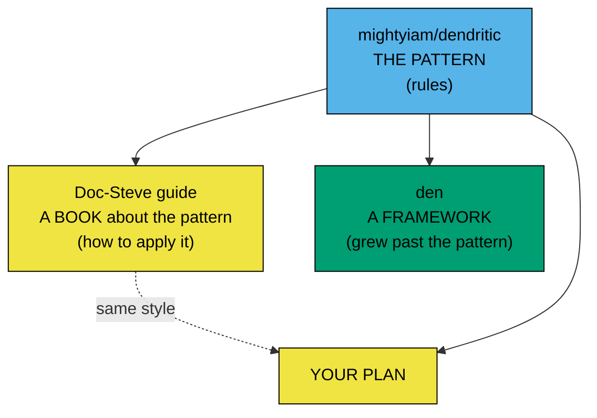
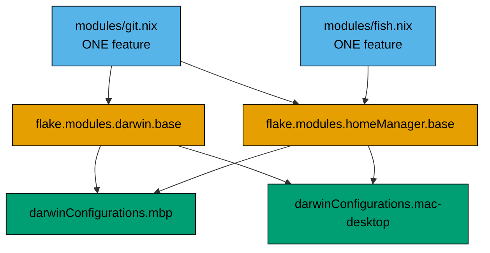
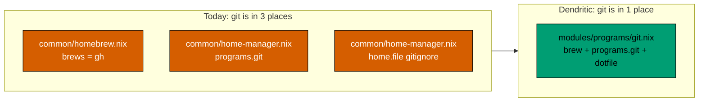
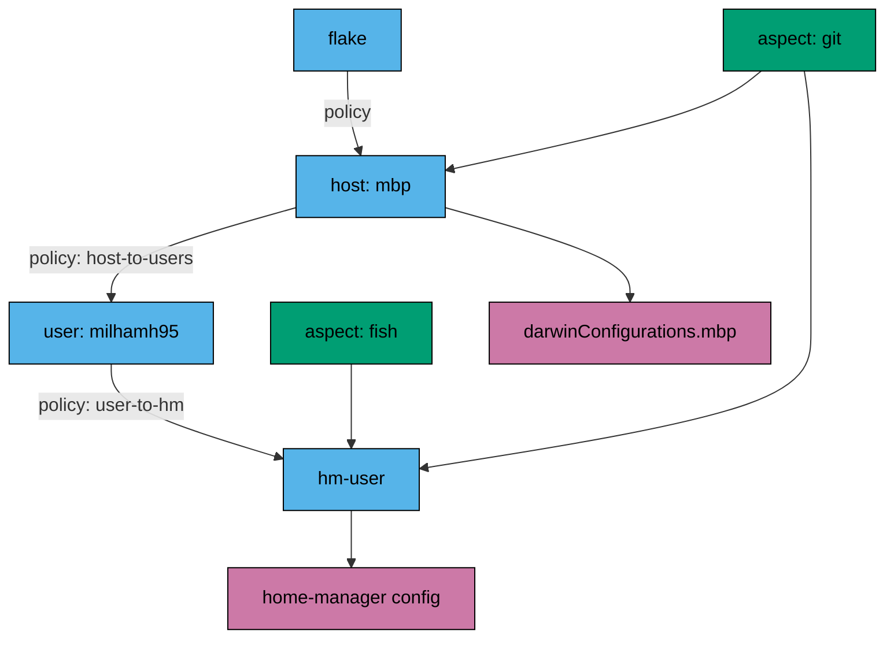
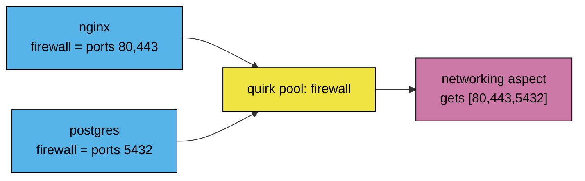
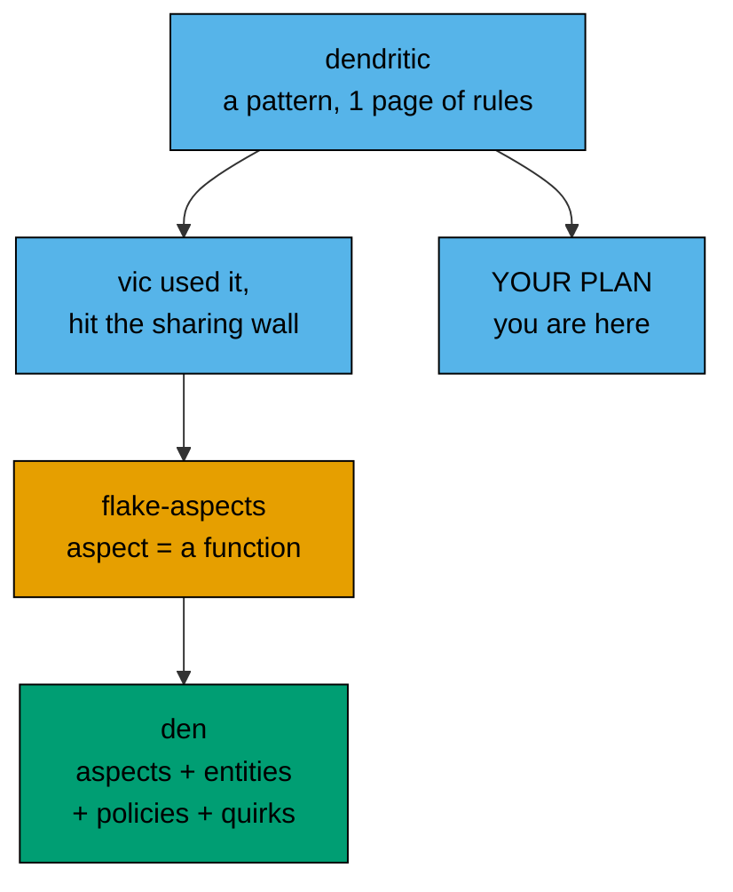
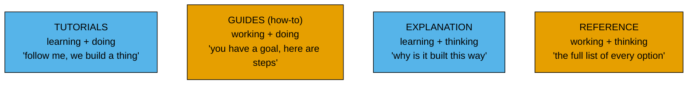

# Dendritic + Den — plain explanation

**Read time: ~12 min. Skim the bold lines if that is all you have.**

---

## 0. The short answer

Your `dendritic-plan.md` is **correct dendritic**. It is not wrong.
It is the *basic* level. There is one anti-pattern in it (section 3).

**Den is dendritic's child, not its rival.** See section 5.5 for the family tree.

| | Dendritic | Den |
|---|---|---|
| What | A *pattern* (a habit) | A *library* (real code you install) |
| Size | 1 page of rules | 60 doc pages |
| You add | `import-tree` only | `den` input + its own language |
| Solves | "my repo is messy" | "I want to share my feature with strangers" |
| Your plan uses | This | Not this |

---

## 0.5 The 3 links you found — who is who

You gave 3 URLs. They are 3 **different kinds of thing**. This trips everybody.

| Link | What it is | Install it? | Storage slot |
|---|---|---|---|
| `mightyiam/dendritic` | The **pattern**. 1 page of rules. The source. | No | you pick |
| `Doc-Steve/dendritic-design-with-flake-parts` | A **guide**. Words + 8 named patterns + example repo. Pure dendritic. | No | `flake.modules` |
| `denful/den` | A **library**. Real Nix code. Own vocabulary. | Yes, a flake input | `den.aspects` |



**Common wrong guess:** "den is a helper built on Doc-Steve's guide."
No. Doc-Steve and den are **siblings**. Both read mightyiam. Neither built on
the other. They cite each other, that is all.

**Second wrong guess:** "den is just a helper."
A helper leaves your code shape alone. Den changes it:

```nix
# Doc-Steve / your plan — a bucket
flake.modules.darwin.base.homebrew.brews = [ "gh" ];

# Den — a function
den.aspects.git = { host, user }: {
  darwin.homebrew.brews = [ "gh" ];
  homeManager.programs.git.enable = true;
};
```

Different syntax. Different mental model. 4 new nouns to learn.
That is a **framework**, not a helper.

**Which link matches your plan? Doc-Steve.** Read his guide. Skip den's docs
unless you are curious.

---

## 1. Dendritic in 3 rules

That is the whole pattern. Three rules.

### Rule 1 — every `.nix` file is a flake-parts module

Not a NixOS module. Not a home-manager module. A **flake-parts** module.

```nix
# modules/git.nix   <- this is a flake-parts module
{
  flake.modules.darwin.base.homebrew.brews = [ "gh" ];
  flake.modules.homeManager.base.programs.git.enable = true;
}
```

### Rule 2 — one file = one feature, across all layers

Git is one feature. So git's system part **and** git's user part live in
**one** file. Not two files in two folders.

### Rule 3 — the file path is just the name

Nothing reads the path. You can move or rename the file freely.
`import-tree` sucks in every file below `modules/`. No import lists ever.

### The picture



Read it bottom-up: hosts **pick** slots. Features **fill** slots.
Old way was top-down: hosts **push** modules down. That is the flip.

---

## 2. Old way vs dendritic — same repo, your repo



To change git you now open **1** file, not 3. That is the payoff.

---

## 3. The one mistake in your plan

Your plan stores **everything** in `flake.modules.<class>.<name>`.
`flake.modules` is a slot that flake-parts already gave you.

The dendritic README calls this an anti-pattern: **"Not declaring options"**.

> Using *only* existing options (such as flake-parts' `flake.modules`)
> for the storage of lower-level modules prevents us from translating our
> mental model of the system into code.

**Plain words:** you are renting somebody else's shelf. You are allowed to
build your own shelf, with your own names, that match how you think.

### What that looks like

```nix
# modules/nix/my-slots.nix   <- your own shelf
{ lib, ... }:
{
  options.myConfig.brewCasks = lib.mkOption {
    type = lib.types.listOf lib.types.str;
    default = [ ];
  };
}
```

Then any file can write to it, and one file reads it all back.

### Do you need this now?

**No.** For 2 macs and 1 user, `flake.modules` is fine.
Do the migration first. Add your own options later, only if a real need shows up.

Mark it as "known, deferred". Do not let it block you.

---

## 4. Two more things worth stealing (from Doc-Steve's guide)

Your plan has 8 slots. Good. Two extra patterns that fit your repo:

### 4.1 The "collector" pattern

Many files write to the **same** name. The module system merges them.
This is exactly how your homebrew split works. You already do this. Good.

### 4.2 The `generic` class for constants

You have `milhamh95` and `/Users/milhamh95` typed in many files.
Put constants in one place, readable from every class:

```nix
# modules/meta/constants.nix
{ lib, ... }:
{
  flake.modules.generic.constants = {
    options.const = lib.mkOption { type = lib.types.attrsOf lib.types.unspecified; };
    config.const.username = "milhamh95";
  };
}
```

Add to your plan as an optional phase 7. Not required.

---

## 5. Den — the four concepts

Den is a **framework**. Bigger idea, more power, more to learn.
Read this part only if you are curious. You do **not** need it for your plan.

### Den's big claim

Dendritic gives you `flake.modules.<class>.<name>` — a flat set of buckets.
Den says: buckets are not enough. A feature should be a **function** that
knows *who* it is being applied to.

```nix
# Den aspect: a feature as a FUNCTION of context
den.aspects.gaming = { host, user }: {
  nixos       = { programs.steam.enable = true; };
  darwin      = { /* ... */ };
  homeManager = { programs.mangohud.enable = true; };
};
```

The function asks for `{ host, user }`. If there is no user in scope, the
function simply **does not run**. No `mkIf`. No `enable` flag.
**The shape of the arguments is the condition.** That is den's core trick.

### The four concepts

| Concept | ELI5 | Where |
|---|---|---|
| **Entity** | *What exists.* A machine, a user, a home. Just data. | `den.hosts`, `den.homes` |
| **Aspect** | *What it does.* One feature, all platforms. | `den.aspects` |
| **Policy** | *How they relate.* "each host has users" is a policy. | `den.policies` |
| **Quirk** | *Shared notes.* Aspects drop data; one aspect picks it up. | `den.quirks` |

### The pipeline



**Entities walk down. Aspects get applied at each stop. Modules fall out.**

### Quirks — the one den idea with no dendritic equal

Problem: many features want to open a firewall port. Each one must know the
option path `networking.firewall.allowedTCPPorts`. That is coupling.

Den lets each feature just **drop a note**:



The producers never name the consumer. The consumer never names producers.

### 5.5 "Is den still dendritic?" — the honest answer

Den's README says *"Den no longer relates to the Dendritic name."*
That line confuses people. Here is what it really means.

Split dendritic into 2 layers. Den kept one and replaced the other.

| Layer | Dendritic rule | Den today |
|---|---|---|
| File layout | every `.nix` file is a flake-parts module, loaded by `import-tree` | **Kept.** Identical. |
| One feature, all platforms | git system part + git user part in 1 file | **Kept.** Den calls it an *aspect*. |
| Storage slot | `flake.modules.<class>.<name>` | **Replaced** by `den.aspects.<name>` |

Only the third row changed. That is the whole "no longer dendritic".

### Why den left `flake.modules`

The den author (`vic`) used dendritic first. He wrote down 3 walls he hit
(`motivation.mdx`):

1. **Flat.** `flake.modules` has no nesting. People faked it with ugly names
   like `flake.modules.nixos."host/desktop"`.
2. **Strings.** Referring to a module was `modules = [ "base" "gaming" ]`.
   A typo is not caught. No type checking.
3. **Not shareable.** Every dendritic module on GitHub had the owner's
   username baked in. To use one file you had to download all their inputs.

Wall 3 is the real one. So an aspect became a **function** that takes
`{ host, user }`. Now the same file works on your mac and on a stranger's.

> **"Den is about sharing functions to configs."**
> That doc line is the point of den. Not "tidy my repo" — dendritic did that.
> Den is about **giving your feature away** to someone with other hosts and
> another username.

### Family tree



Den is a **descendant** of dendritic. Not a rival. Not a rejection.
The rename was to stop people thinking den == dendritic.

### 5.6 How vic grew past the pattern

From den's `motivation.mdx`. Five steps.

1. Vic ran his own config (`vic/vix`) in **pure dendritic**. Liked it a lot.
2. He wanted **dendrix** — a "NUR for dendritic aspects". Browse other
   people's features, grab one, use it.
3. **It failed.** Every module on GitHub had the owner's username and host
   baked in. And to use one file you had to download **all** of that
   person's flake inputs.
4. He saw `unify` (the first dendritic framework). Loved its `<aspect>.<class>`
   shape. Hated that references were **strings**: `modules = [ "base" "gaming" ]`.
5. His verdict, quoted:

   > "The problem was not about syntax, not about how things are loaded from
   > filesystem nor how they are wired at the flake level.
   > **The problem was more about feature composability.**"

   The most composable thing in programming is a **function**.
   So: an aspect became a function.

That gave [`flake-aspects`](https://github.com/denful/flake-aspects) — zero
dependencies, works with or without flakes. **Den = flake-aspects + host/user
wiring + policies + quirks.**

### The proof is inside Doc-Steve's own repo

His **Factory Aspect** is a hand-rolled function:

```nix
# Doc-Steve: modules/factory/user [ND]/user.nix
config.flake.factory.user = username: isAdmin: {
  nixos."${username}"       = { /* ... */ };
  darwin."${username}"      = { /* ... */ };
  homeManager."${username}" = { home.username = username; };
};
```

Read it again. **A function that takes context and returns config for 3
classes.** That is exactly a den aspect — written by hand, because
`flake.modules` cannot do it natively.

Den's version of the same thing:

```nix
den.aspects.user = { user }: {
  nixos.users.users.${user.userName} = { /* ... */ };
  darwin.users.users.${user.userName} = { /* ... */ };
  homeManager.home.username = user.userName;
};
```

**Doc-Steve found the pattern. Vic made it the whole language.**

### 5.7 Den vs Doc-Steve — the 7 real differences

| # | Thing | Doc-Steve (= your plan) | Den |
|---|---|---|---|
| 1 | Slot shape | flat: `flake.modules.<class>.<name>` | nested: `den.aspects.a.b.c` |
| 2 | Referring to a feature | `self.modules.nixos.foo` — a string key. Typo gives a weird error. | `den.aspects.foo` — a value. Typo gives "undefined variable". |
| 3 | Conditions | `lib.mkIf pkgs.stdenv.isDarwin { ... }` | argument shape: `{ host, user }: ...` skips itself when no user |
| 4 | Host data inside a module | constants module or `specialArgs`. Can hit infinite recursion. | `{ host }:` is a **real function arg**, resolved *before* module eval. No recursion possible. |
| 5 | Parameterised features | hand-write a factory (see above) | built in — every aspect can be parametric |
| 6 | Data shared between features | Collector: merge into one name. One class, one config. | Quirks: decoupled, works across users and across hosts. |
| 7 | Sharing with strangers | hard — username baked in, all inputs pulled | this is the whole point of den |

### What den does NOT change

- Same `import-tree`, same auto-import.
- Same one-file-per-feature rule.
- Same `darwin-rebuild switch --flake .#mbp`.
- Same NixOS/HM option names inside the blocks.

### Should you use den?

**No, not now.** Reasons:

1. You have 2 macs, 1 user, no NixOS. Den's power is fleets and cross-host data.
2. Den is a whole extra vocabulary on top of Nix. That is a second mountain.
3. Your plan already delivers the win you want: one file per feature.

Revisit den if you ever get 5+ machines or share config with other people.

---

## 6. Den's docs folder — what the 4 words mean

The den docs use **Diátaxis**. It is a standard way to split docs into 4 boxes.
Once you know the boxes, the docs stop feeling random.



| Folder | Mood | You go there when | Den example |
|---|---|---|---|
| `tutorials/` | "teach me" | You know nothing. Want to copy-run something. | `tutorials/minimal` — a runnable flake |
| `guides/` | "help me do X" | You have a goal. | `guides/from-flake-to-den` — migrate |
| `explanation/` | "why?" | You want the mental model. | `explanation/core-principles` |
| `reference/` | "the exact spelling" | You are writing code and forgot an arg. | `reference/glossary` |

**Simple rule:** confused → `explanation/`. Stuck → `guides/`. New → `tutorials/`.
Typing code → `reference/`.

### Best 3 den pages, in order

1. `explanation/core-principles` — the whole idea in 1 page.
2. `explanation/quirks-and-pipes` — the idea dendritic does not have.
3. `guides/from-flake-to-den` — what a migration actually costs.

---

## 7. Verdict on `dendritic-plan.md`

| Part | Verdict |
|---|---|
| Every file is a flake-parts module | Correct dendritic |
| `import-tree ./modules` | Correct dendritic |
| One file = one feature, both layers | Correct dendritic. This is the heart. |
| 8 slots only, not 1 slot per file | Correct. Avoids "name proliferation" anti-pattern. |
| `inputs.self + "/dotfiles/..."` | Correct and important |
| Homebrew split per app | Correct. This is the "collector" pattern. |
| Only `flake.modules`, no own options | **Anti-pattern, but safe at your size.** Defer. |
| No `enable` flags | Correct. Dendritic says importing = enabling. |
| Phase order + build hash check | Good engineering. Keep it. |

**Score: the plan is right. Execute it as written.**

---

## 8. What to do next

Two options. Pick one.

**Option A — run the plan (I would pick this).**
Start phase 1. New `flake.nix` + `modules/meta/*` + 2 host files. ~45 min.
You get a working dendritic repo after phase 3 (~2 hours 15 min).

**Option B — read first.**
Open `explanation/core-principles` on https://den.denful.dev.
15 min. Then decide if den tempts you. It probably will not, at 2 machines.

**Next action right now (2 min):**

```bash
nix flake update flake-parts
```

Your plan section 8 item 1 needs this. Do it before phase 1.
