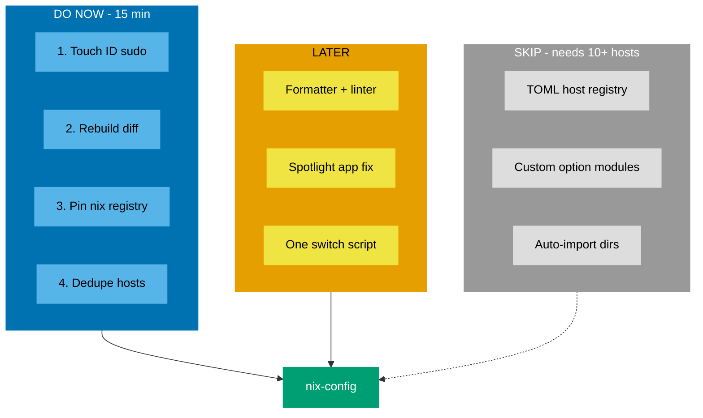

# Nix Config — What to Improve

Compared this repo against 5 community nix-darwin configs.

> **Verdict: your structure is good. Do not rewrite it.**
> `common/` + `profiles/` + `hosts/` is correct. Two of the five repos are worse.
> You already have sops-nix secrets, devShells, and `CustomUserPreferences` — several of them do not.

Only small additions are missing.

---

## Priority Map



---

## Do Now

### 1. Touch ID for sudo

Use your fingerprint instead of typing a password.

<details>
<summary>Code — goes in <code>common/system-defaults.nix</code></summary>

```nix
security.pam.services.sudo_local.touchIdAuth = true;
```

Verified working with the pinned nix-darwin in `flake.lock`.
</details>

### 2. Show what changed on rebuild

Right now `darwin-rebuild switch` tells you nothing. This prints a package diff.

<details>
<summary>Code — goes in <code>common/system-defaults.nix</code></summary>

```nix
system.activationScripts.diff = {
  supportsDryActivation = true;
  text = ''
    ${pkgs.nvd}/bin/nvd --nix-bin-dir=${pkgs.nix}/bin diff /run/current-system "$systemConfig"
  '';
};
```

Needs `{ pkgs, ... }` in the file header.
</details>

### 3. Pin `nix shell` to your locked nixpkgs

Today `nix shell nixpkgs#foo` downloads a **separate** nixpkgs. Slow and wasteful.

<details>
<summary>Code — goes in <code>mkBaseConfiguration</code> in <code>flake.nix</code></summary>

```nix
nix.registry.n.to = { type = "path"; path = nixpkgs; };
nix.channel.enable = false;
```

Must live in `flake.nix` — that is the only place `nixpkgs` is in scope.
After this, use `nix shell n#ripgrep`.
</details>

### 4. Stop listing hosts twice

`flake.nix` names every host in `hostConfigs`, then again in `darwinConfigurations`.

<details>
<summary>Code — replaces the <code>darwinConfigurations</code> block</summary>

```nix
darwinConfigurations = nixpkgs.lib.mapAttrs (_: mkDarwinConfig) hostConfigs;
```

Adding a machine becomes one edit instead of two.
</details>

---

## Later

- **Formatter + linter** — `nixfmt`, `statix`, `deadnix`. You have none. Add as a `formatter` flake output.
- **Spotlight app fix** — Nix installs GUI apps as symlinks; Spotlight and Raycast ignore symlinks. Fix uses `mkalias` or the `mac-app-util` input. Needs testing, so do it alone.
- **One switch script** — a script that reads `hostname -s` replaces every per-host `Makefile` target.

---

## Skip

These appear in the bigger repos. They solve pain at 10+ machines. You have 2. They would only make the config harder to read.

- TOML host registry with auto-discovery
- Custom module options (`options.myconfig.*`) to replace `profiles/`
- Auto-importing every module from a directory
- `nix-homebrew` — the built-in `homebrew` module you use is fine

---

<details>
<summary>Repos reviewed</summary>

| Repo | Useful for you |
|---|---|
| `lucamaraschi/nix-me` | Touch ID, `/etc` backup on first switch, GUI app PATH |
| `x0d7x/nix-config` | Spotlight `mkalias` fix, `require_sha` for casks |
| `ironicbadger/nix-config` | `nix.registry` pins, justfile, bootstrap script |
| `wimpysworld/nix-config` | Formatter output, CI workflows |
| `shayne/nixos-config` | `nvd` rebuild diff, lint tasks |

Clones are at `/Users/milhamh95/nix/reference/`.

**Common warning:** several use `nix.enable = false` for the Determinate installer. That loses declarative garbage collection. Your setup is better — do not copy it.
</details>
