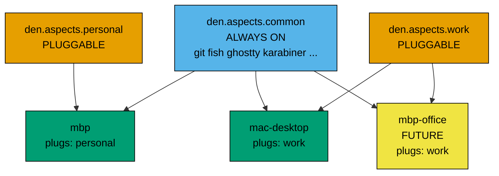
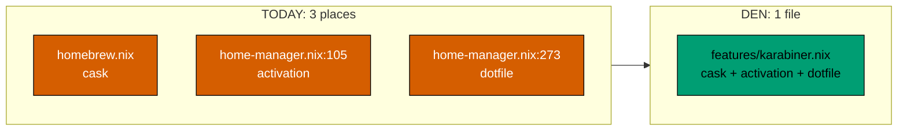

# Your config in `denful/den` — decision document

**This is a decision doc, not a to-do list.** It shows what den would look
like for *your* repo, what it costs, and where it hurts. Decide at the end.

**Read time: ~20 min.** Bold lines and tables carry the answer.

---

## 0. TL;DR

| Question | Answer |
|---|---|
| Does den fit your repo? | **Yes.** Cleanly. |
| Is it better than `dendritic-plan.md`? | **Yes, in 3 real ways.** See section 4. |
| What does it cost? | **2–3 days**, vs 5 hours for the dendritic plan. |
| Biggest risk | den is `v0.x`, *"fast-paced, evolving"*. Pin it. |
| Biggest win | Your app files stop being split in 3 places, **and** one include delivers both the system half and the user half. |
| My verdict | **Do it.** You want all four of learning, more machines, sharing, and cleanliness. Den is the only option that serves all four. |

**But read section 7 first.** Some of your config does *not* get better,
and I want you to see that before you commit.

---

## 1. The design we agreed



**Rules of the model:**

1. `common` is always on. Written once. Every machine gets it.
2. `work` and `personal` are **plugs**. A host adds a line to plug one in.
3. Delete the line to unplug. A host can plug in both.
4. Features hang off **you**, not off the machines.

This is your existing `profiles = [ "work" ]` idea, kept intact.

---

## 2. The plug, in one line

```nix
# modules/hosts/mac-desktop.nix
den.aspects.mac-desktop = {
  darwin.system.defaults.dock.tilesize = 48;           # host-only bits
  provides.to-users.includes = [ den.aspects.work ];   # <-- PLUG IN
};
```

- **Plug in:** add the line.
- **Unplug:** delete the line.

**Why `provides.to-users` and not plain `includes`?** Because of a trap.
See section 7.1. Short version: `to-users` resolves in the **user** scope,
where both `darwin` and `homeManager` content route correctly. Plain host
`includes` would silently drop the `homeManager` half.

I confirmed `provides.to-users.includes` is real, tested den API:
`templates/ci/modules/features/projected-hasaspect-rules.nix:34` and `:72`.

---

## 3. Target file tree

```
flake.nix                        auto-generated by flake-file, ~25 lines
dotfiles/                        ONE folder at the repo root
modules/
  den.nix                        imports den.flakeModule
  dendritic.nix                  flake-file inputs
  hosts.nix                      3 lines. All machines.
  defaults.nix                   stateVersion, allowUnfree, overlays

  users/
    milhamh95.nix                define-user + user-shell + common
    milhamh-work.nix             FUTURE: + work

  layers/
    common.nix                   includes every feature aspect
    work.nix                     bloom, tableplus, $HOME/work
    personal.nix                 $HOME/personal

  hosts/
    mbp.nix                      dock size, batfi, plug: personal
    mac-desktop.nix              dock size, plug: work

  features/                      ~30 files, ONE aspect each
    git.nix  fish.nix  fish-abbr.nix  fish-functions.nix
    ghostty.nix  wezterm.nix  ssh.nix  bat.nix  atuin.nix
    fastfetch.nix  mise.nix  karabiner.nix  shottr.nix
    flashspace.nix  recordly.nix  sdkman.nix  better-audio.nix
    kickapp.nix  browsers.nix  api-tools.nix  window-tools.nix
    media.nix  desktop.nix  mas.nix  homebrew-engine.nix
    nix-packages.nix  system-defaults.nix  sops.nix
    activation-fix.nix

  dev/
    postgres.nix  redis.nix  sops.nix  default-shell.nix
```

**About 40 files.** Same count as `dendritic-plan.md`. Flat, one aspect per
file — I checked, that is den's own practice in `templates/default` and
`templates/example`. Nesting is only used when publishing an aspect library.

---

## 4. What den does that your dendritic plan cannot

Three real differences. Not opinions — I verified each in den's source.

### 4.1 One include delivers BOTH halves

Your app files are **cask (system) + dotfile (user)**. That is 90% of your repo.

**In `dendritic-plan.md`,** the host file must wire both sides by hand:

```nix
# dendritic: hosts/mbp.nix
flake.darwinConfigurations.mbp = darwinSystem {
  modules = [
    config.flake.modules.darwin.base        # <- casks come from here
    config.flake.modules.darwin.mbp
  ];
};
flake.modules.darwin.mbp = {
  home-manager.users.milhamh95.imports = [
    config.flake.modules.homeManager.base   # <- dotfiles come from here
    config.flake.modules.homeManager.mbp
  ];
};
```

Two parallel wiring paths. Add a slot, wire it twice.

**In den,** the user aspect's `darwin` content flows **up** to the host:

```nix
den.aspects.ghostty = {
  darwin.homebrew.casks = [ "ghostty" ];    # -> flows UP to the host
  homeManager.programs.ghostty = { ... };    # -> goes to your HM
};

den.aspects.common.includes = [ den.aspects.ghostty ];   # ONE line, both halves
```

**Verified.** Den's own CI test proves it:

```
templates/ci/modules/public-api/user-host-mutual-config.nix:206
  den.aspects.tux.nixos.programs.fish.enable = true;
  expr     = [ igloo.programs.fish.enable  iceberg.programs.fish.enable ];
  expected = [ true                        true                         ];
```

A user aspect's OS content lands on **every host that user lives on**.

### 4.2 The office mac problem is solved

If you get a locked-down office mac with no root, dendritic has no answer —
nix-darwin needs root. Den has a second door:

```nix
den.homes.aarch64-darwin."milhamh-work@MBP-JKT-0421" = { };
```

That produces `homeConfigurations."milhamh-work@MBP-JKT-0421"`. The
`home-manager` CLI picks it automatically because it matches `whoami` and
`hostname`. No root needed.

**And it reads the same `den.aspects.common`.** You write your tool list once
and it serves full nix-darwin hosts *and* a locked-down laptop.

### 4.3 Typos become errors

```nix
# dendritic-plan.md - a string key
config.flake.modules.homeManager.bsae     # -> weird merge error, or silence

# den - a value
den.aspects.bsae                          # -> error: undefined variable 'bsae'
```

---

## 5. Worked example 1 — `flake.nix` + hosts

### Before: 4 places, ~180 lines

| File | Lines | Job |
|---|---|---|
| `flake.nix` | 122 | inputs, hostConfigs table, profile tables, mkBaseConfiguration |
| `lib/mkDarwinConfig.nix` | 47 | builds darwinSystem, wires home-manager |
| `hosts/mbp/default.nix` | 6 | `networking.hostName = "mbp"` |
| `hosts/mac-desktop/default.nix` | 6 | `networking.hostName = "mac-desktop"` |

### After: 4 files, ~50 lines

```nix
# flake.nix                            AUTO-GENERATED by flake-file. Do not edit.
{
  outputs = inputs:
    inputs.flake-parts.lib.mkFlake { inherit inputs; } (inputs.import-tree ./modules);

  inputs = {
    den.url = "github:denful/den/latest";       # PINNED. See section 8.
    flake-file.url = "github:denful/flake-file";
    flake-parts.url = "github:hercules-ci/flake-parts";
    import-tree.url = "github:denful/import-tree";
    nixpkgs.url = "github:NixOS/nixpkgs/nixpkgs-unstable";
    nix-darwin = { url = "github:LnL7/nix-darwin"; inputs.nixpkgs.follows = "nixpkgs"; };
    home-manager = { url = "github:nix-community/home-manager"; inputs.nixpkgs.follows = "nixpkgs"; };
    sops-nix = { url = "github:Mic92/sops-nix"; inputs.nixpkgs.follows = "nixpkgs"; };
  };
}
```

```nix
# modules/hosts.nix                    YOUR WHOLE FLEET
{
  den.hosts.aarch64-darwin = {
    mbp.users.milhamh95         = { };
    mac-desktop.users.milhamh95 = { };
  };
}
```

That is it. Three lines replace the `hostConfigs` table, the two profile
tables, and all of `mkDarwinConfig.nix`. Den calls `darwinSystem` for you and
wires home-manager for you.

```nix
# modules/den.nix
{ inputs, lib, ... }:
{
  imports = [ inputs.den.flakeModule ];
  den.schema.user.classes = lib.mkDefault [ "homeManager" ];
}
```

```nix
# modules/defaults.nix                 applies to ALL hosts and users
{ den, ... }:
{
  den.default.darwin = {
    system.stateVersion = 6;
    nix.settings.experimental-features = "nix-command flakes";
    nixpkgs.config.allowUnfree = true;
    nixpkgs.overlays = [
      (final: prev: { fish = prev.fish.overrideAttrs (_: { doCheck = false; }); })
    ];
  };
  den.default.homeManager.home.stateVersion = "25.05";
  den.default.includes = [ den.batteries.hostname ];   # sets networking.hostName
}
```

```nix
# modules/users/milhamh95.nix
{ den, ... }:
{
  den.aspects.milhamh95 = {
    includes = [
      den.batteries.define-user            # users.users.<n>.home + name + HM username
      den.batteries.primary-user           # darwin: system.primaryUser
      (den.batteries.user-shell "fish")    # shell + programs.fish + environment.shells
      den.aspects.common
    ];
    # nix-darwin needs these; no battery covers them
    darwin.users.knownUsers = [ "milhamh95" ];
    darwin.users.users.milhamh95.uid = 501;
  };
}
```

```nix
# modules/hosts/mbp.nix
{ den, ... }:
{
  den.aspects.mbp = {
    darwin = {
      system.defaults.dock.tilesize = 65;
      system.defaults.controlcenter.BatteryShowPercentage = true;
      homebrew.casks = [ "batfi" ];
    };
    provides.to-users.includes = [ den.aspects.personal ];   # PLUG
  };
}
```

**Batteries I verified in source, that replace your hand-written lines:**

| Your line today | Battery |
|---|---|
| `system.primaryUser = username` | `den.batteries.primary-user` |
| `users.users.<n>.shell = pkgs.fish` + `programs.fish.enable` | `den.batteries.user-shell "fish"` |
| `users.users.<n>.home = "/Users/<n>"` + `name` | `den.batteries.define-user` |
| `networking.hostName` | `den.batteries.hostname` |
| `nixpkgs.config.allowUnfree = true` | `den.provides.unfree [ "vscode" ... ]` (per-package, safer) |

`users.knownUsers` and `uid = 501` have **no battery**. You keep them by hand.

---

## 6. Worked example 2 — karabiner, the win in miniature

### Before: 1 app, 3 places

```nix
# common/homebrew.nix
casks = [ ... "karabiner-elements" ... ];

# common/home-manager.nix:105
configureKarabiner = lib.hm.dag.entryBefore ["checkLinkTargets"] ''
  if [ -f "$HOME/.config/karabiner/karabiner.json.backup" ]; then
    $DRY_RUN_CMD rm -f "$HOME/.config/karabiner/karabiner.json.backup"
  fi
'';

# common/home-manager.nix:273
".config/karabiner/karabiner.json" = {
  source = ./dotfiles/karabiner/karabiner.json;
  onChange = ''echo "Karabiner config changed"'';
};
```

To change karabiner, you open **3 files** and scroll a 429-line one twice.

### After: 1 app, 1 file

```nix
# modules/features/karabiner.nix
{ inputs, lib, ... }:
{
  den.aspects.karabiner = {
    darwin.homebrew.casks = [ "karabiner-elements" ];

    homeManager = {
      home.file.".config/karabiner/karabiner.json" = {
        source = inputs.self + "/dotfiles/karabiner/karabiner.json";
        onChange = ''echo "Karabiner config changed"'';
      };

      home.activation.configureKarabiner =
        lib.hm.dag.entryBefore [ "checkLinkTargets" ] ''
          if [ -f "$HOME/.config/karabiner/karabiner.json.backup" ]; then
            $DRY_RUN_CMD rm -f "$HOME/.config/karabiner/karabiner.json.backup"
          fi
        '';
    };
  };
}
```

Then one line in `modules/layers/common.nix`:

```nix
den.aspects.common.includes = [ den.aspects.karabiner  /* ... */ ];
```

**Delete karabiner entirely:** delete the file, delete the line. Done.



**Note:** `dendritic-plan.md` also achieves this. The extra den win is that
`common` needs **one** include line, not two wiring paths (section 4.1).

---

## 7. Worked example 3 — the 429-line monster

`common/home-manager.nix` is your scariest file. **Be honest with yourself
here: den does not make this file smaller. It only splits it.**

### What is in it

| Lines | Block | New home |
|---|---|---|
| 6 | `home.stateVersion` | `modules/defaults.nix` |
| 9–18 | sops secrets | `features/sops.nix` |
| 25–29 | `fixReadlinkM` | `features/activation-fix.nix` |
| 30–39 | `configureTide` | `features/fish.nix` |
| 40–47 | `configureShottr` | `features/shottr.nix` |
| 48–55, 113–191 | Recordly (~85 lines of curl + GitHub API) | `features/recordly.nix` |
| 56–96 | SDKMAN (~40 lines) | `features/sdkman.nix` |
| 97–104 | `configurePersonalFolder` | `layers/personal.nix` |
| 105–112 | `configureKarabiner` | `features/karabiner.nix` |
| 192–271 | BetterAudio (~79 lines) | `features/better-audio.nix` |
| 273–311 | 7 × `home.file` | split across 6 feature files |
| 313–315 | `home.sessionPath` | `modules/defaults.nix` |
| 317–425 | ghostty, ssh, bat, git, wezterm, delta | 6 feature files |

### The honest truth about activation scripts

```nix
# den — the activation script is UNCHANGED. Byte for byte.
den.aspects.recordly.homeManager = { lib, pkgs, ... }: {
  home.activation.installRecordly = lib.hm.dag.entryAfter [ "writeBoundary" ] ''
    RECORDLY_APP="/Applications/Recordly.app"
    GITHUB_API="https://api.github.com/repos/webadderallorg/Recordly/releases/latest"
    RELEASE_INFO=$(${pkgs.curl}/bin/curl -sf ...)
    # ... all 78 lines, exactly as today ...
  '';
};
```

**Inside `homeManager = { ... }` it is a plain home-manager module.** Den
does not touch it, improve it, or understand it. Your ~200 lines of bash
stay ~200 lines of bash.

**What you actually gain:** those 200 lines stop living in one 429-line file
next to unrelated things. Recordly's bash sits in `recordly.nix`, alone.

**What you do not gain:** nothing about the bash gets simpler.

### The sops gotcha

```nix
# today
enableSecrets = !(builtins.pathExists ../secrets/.skip);
```

That relative path breaks when the file moves. Rewrite as:

```nix
enableSecrets = !(builtins.pathExists (inputs.self + "/secrets/.skip"));
```

**Same fix as `dendritic-plan.md` section 8.3.** Not a den problem.

---

## 8. Worked example 4 — devShells and sops survive untouched

**This is the boring good news.** Den is a flake-parts module. `perSystem`
keeps working.

```nix
# modules/dev/postgres.nix
{
  perSystem = { pkgs, ... }: {
    devShells.postgres = pkgs.mkShell {
      # body of dev/postgres.nix, unchanged
    };
  };
}
```

`nix develop .#postgres` works exactly as today.

| Your thing | Cost in den |
|---|---|
| 4 devShells | ~0. Move to `perSystem`, same as the dendritic plan. |
| sops-nix HM module | ~0. Just an import inside `homeManager = { ... }`. |
| 200 lines of activation bash | ~0. Copy-paste. Unchanged. |
| homebrew casks / brews / masApps | ~0. Plain nix-darwin options inside `darwin = { ... }`. |
| Dotfiles | Same work as the dendritic plan: one root folder + `inputs.self`. |

**Verified:** `explanation/coming-from.mdx` — *"You can use `perSystem`
alongside Den for outputs that do not involve host or user entities
(packages, devShells, checks)."*

---

## 9. What will bite you

Five real traps. I found all five in den's source or docs.

### 9.1 Host-scope `homeManager` is silently inert

```nix
# THIS SILENTLY DOES NOTHING
den.aspects.mac-desktop.homeManager.programs.git.enable = true;
```

Den's own docs, `guides/home-manager.mdx`:

> "A host-scope parametric aspect now fans out over the users but emits
> class-locally **on the host**, where `homeManager` is inert — so that
> content never reaches the users' Home Manager evaluation."

**No error. No warning. It just does not happen.**

**Fix:** anything user-facing goes through `provides.to-users`, or lives on
the user aspect. This is why section 2 uses `provides.to-users.includes`.

**This is the single most likely thing to waste an afternoon.**

### 9.2 `define-user` does not do everything

Verified by reading `modules/aspects/batteries/define-user.nix`. It sets:

- `users.users.<n>.name`
- `users.users.<n>.home` = `/Users/<n>` on darwin
- `home.username`, `home.homeDirectory`

It does **not** set `uid`, `shell`, or `users.knownUsers`. Your config needs
all three. Keep them by hand (shown in section 5).

### 9.3 `v0.x` moves fast

`releases.mdx`:

> "Den development is currently fast-paced, evolving and being shaped by its
> current users."

Main updates on **every PR merge**. Den asks main-trackers to follow
`heads-up` announcements on GitHub, Zulip and Matrix.

**Mitigation, agreed:** pin `github:denful/den/latest` during the migration.
Move to `main` once your machines boot. Changing it is one word.

### 9.4 flake-file makes `flake.nix` read-only

You adopt a second new tool. `flake.nix` becomes generated:

```
# DO-NOT-EDIT. This file was auto-generated using github:vic/flake-file.
```

Add an input in a module, then run `nix run .#write-flake`.

**If this annoys you, drop flake-file.** Den works fine with a hand-written
`flake.nix`. You just lose "inputs live next to their user".

### 9.5 Debugging is harder than plain Nix

Den is an effects pipeline. When an aspect does not apply, the reason may be
that its argument shape did not match the context — and nothing errors.

Den ships tools for this (`den.lib.capture`, the `trace` helper, `--show-trace`),
and its CI has 180+ tests. But the failure mode "my config silently did
nothing" is new. Plain Nix does not have it.

---

## 10. Cost and risk

### Hours

| Phase | Work | Time |
|---|---|---|
| 0 | Read `from-flake-to-den` + `core-principles` + the `default` template | 2 h |
| 1 | Branch. New `flake.nix`, `den.nix`, `hosts.nix`, `defaults.nix`, 2 host files. **Builds, near-empty.** | 2 h |
| 2 | `users/milhamh95.nix` + batteries. Dotfiles to root, `inputs.self`. **Builds.** | 2 h |
| 3 | Straight moves: fish, git, atuin, bat, mise, fastfetch, ssh, ghostty, wezterm | 3 h |
| 4 | Split the 429-line monster into ~12 feature files | 4 h |
| 5 | Split homebrew by app. ~14 feature files. | 2 h |
| 6 | `work` + `personal` layers, plugs on both hosts | 1 h |
| 7 | devShells to `perSystem`. Delete old dirs. Update `Makefile`, `scripts/`. | 2 h |
| 8 | Build-hash compare, fix drift, switch both machines | 2 h |
| | **Total** | **~20 h** |

**About 2.5 focused days.** Call it a week of evenings.

`dendritic-plan.md` is ~5 h. **Den costs 4× more.**

### Risk table

| Risk | Likelihood | Damage | Mitigation |
|---|---|---|---|
| Inert `homeManager` trap (9.1) | **High** | Half a day lost | Never put HM content on a host aspect. Use `provides.to-users`. |
| den breaks under you | Low | Confusing | Pin `latest`. Bump only when green. |
| A feature silently does not apply | Medium | Frustrating | Compare build hashes per phase, not at the end. |
| flake-file confusion | Medium | Annoying | Drop it if it bites. Optional. |
| You abandon halfway | Medium | Wasted time | Branch stays. `main` still boots. |

### The safety net

```bash
# BEFORE you start, on main:
nix build .#darwinConfigurations.mbp.system         --no-link --print-out-paths > /tmp/before-mbp.txt
nix build .#darwinConfigurations.mac-desktop.system --no-link --print-out-paths > /tmp/before-md.txt

# AFTER each phase, on the branch:
nix build .#darwinConfigurations.mbp.system --no-link --print-out-paths
# same hash  = perfect migration
# different  = nix store diff-closures /tmp/before-mbp.txt <new>
```

**Run this per phase.** Not once at the end. Big-bang plus per-phase hashing
is how you keep "which change broke it" answerable.

---

## 11. Den vs your dendritic plan, side by side

| | `dendritic-plan.md` | den |
|---|---|---|
| Time | **5 h** | 20 h |
| New dependency | none | den (`v0.x`) + flake-file |
| One file per feature | yes | yes |
| Cask + dotfile in one file | yes | yes |
| **One include delivers both halves** | no — two wiring paths | **yes** |
| Typo caught by Nix | no (strings) | **yes** (values) |
| Locked-down office mac | no answer | **`den.homes` standalone** |
| Ready for a NixOS box | rewrite host wiring | **add 1 line to `hosts.nix`** |
| Shareable with strangers | no — username baked in | **yes — that is den's purpose** |
| Silent-failure modes | few | **more** (9.1, 9.5) |
| Can you leave later | free, it is plain Nix | another rewrite |

---

## 12. Verdict

**Do den.**

You told me all four things matter: learning, more machines, sharing, and a
cleaner repo. Look at the table above. **Dendritic serves two of them. Den
serves four.** Nothing else does.

The three arguments I made against den earlier no longer apply:

| Old objection | Why it is dead |
|---|---|
| "You have no one to share with" | You said sharing is a driver. |
| "You have no NixOS box" | You said more machines are coming. |
| "Dendritic gets you the same win" | **False.** Sections 4.1–4.3 are den-only. |

The cost is real: **20 hours, not 5.** But your repo is 2716 lines. That is
small. This is the cheapest this migration will ever be.

### The one thing that would change my mind

If you need both machines rock-solid for work in the next two weeks, do
`dendritic-plan.md` now (5 h, zero risk) and den later. Dendritic is not
wasted work — it is the mental model den is built on, and the file split
carries over almost unchanged.

Otherwise: **den, on a branch, phased, hash-checked.**

---

## 13. Future: when the office mbp arrives

Not now. Here for later.

```nix
# modules/hosts.nix                 add one line
den.hosts.aarch64-darwin = {
  mbp.users.milhamh95           = { };
  mac-desktop.users.milhamh95   = { };
  mbp-office.users.milhamh-work = { };   # NEW
};
```

```nix
# modules/users/milhamh-work.nix    NEW file
{ den, ... }:
{
  den.aspects.milhamh-work = {
    includes = [
      den.batteries.define-user
      den.batteries.primary-user
      (den.batteries.user-shell "fish")
      den.aspects.common               # SAME common. Written once.
    ];
    darwin.users.users.milhamh-work.uid = 502;
  };
}
```

```nix
# modules/hosts/mbp-office.nix      NEW file
den.aspects.mbp-office.provides.to-users.includes = [ den.aspects.work ];
```

**If the office locks the machine and you get no root**, use the other door
instead — no host file at all:

```nix
den.homes.aarch64-darwin."milhamh-work@MBP-JKT-0421" = { };
```

Then `home-manager switch`. It auto-selects by `whoami` + `hostname`.

**Office controls the hostname?** Just do not include
`den.batteries.hostname` on that host. Den then never touches the name.

---

## 14. Next action

**Do not start coding. Do this first, it takes 30 minutes:**

```bash
mkdir -p /tmp/den-play && cd /tmp/den-play
nix flake init -t github:denful/den#default
```

Read the 7 files it makes. They are small. That is the whole model.

Then decide. If it clicks, phase 1 is a 2-hour evening.

**Right now (2 min), take the safety snapshot while `main` still works:**

```bash
nix build .#darwinConfigurations.mbp.system         --no-link --print-out-paths > /tmp/before-mbp.txt
nix build .#darwinConfigurations.mac-desktop.system --no-link --print-out-paths > /tmp/before-md.txt
```

---

## Appendix — sources

Everything above was checked against a clone of `denful/den`, not from memory.

| Claim | Source |
|---|---|
| User aspect's OS content reaches the host | `templates/ci/modules/public-api/user-host-mutual-config.nix:206` |
| `provides.to-users.includes` is valid API | `templates/ci/modules/features/projected-hasaspect-rules.nix:34,72` |
| Host-scope `homeManager` is inert | `docs/.../guides/home-manager.mdx`, final section |
| `define-user` skips uid/shell/knownUsers | `modules/aspects/batteries/define-user.nix` |
| `primary-user` sets `darwin.system.primaryUser` | `modules/aspects/batteries/primary-user.nix` |
| `user-shell` sets shell at OS + HM | `modules/aspects/batteries/user-shell.nix` |
| `perSystem` still works | `docs/.../explanation/coming-from.mdx` |
| Standalone home `"user@host"` | `docs/.../guides/home-manager.mdx` |
| default template is recommended | `docs/.../tutorials/overview.mdx`, `tutorials/default.mdx` |
| `v0.x` is fast-paced; `latest` tag exists | `docs/.../releases.mdx` |
| Flat aspects are den's own practice | `templates/default/modules/`, `templates/example/modules/aspects/eg/` |
| `den.provides.unfree` battery | `templates/ci/modules/public-api/unfree.nix` |
