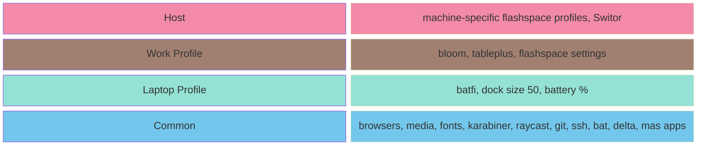
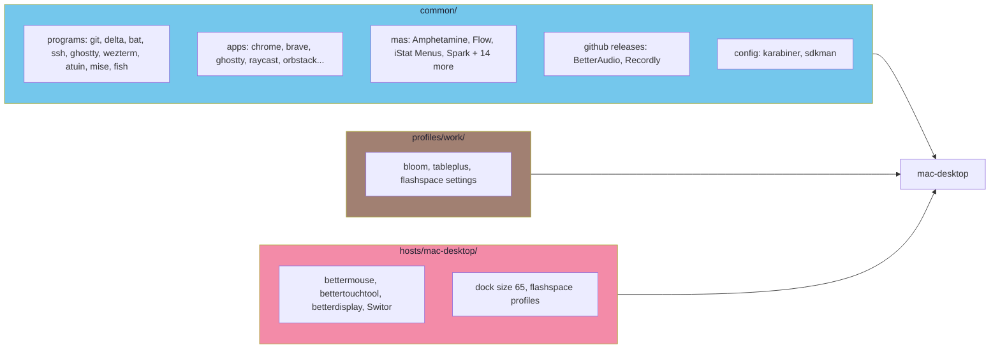
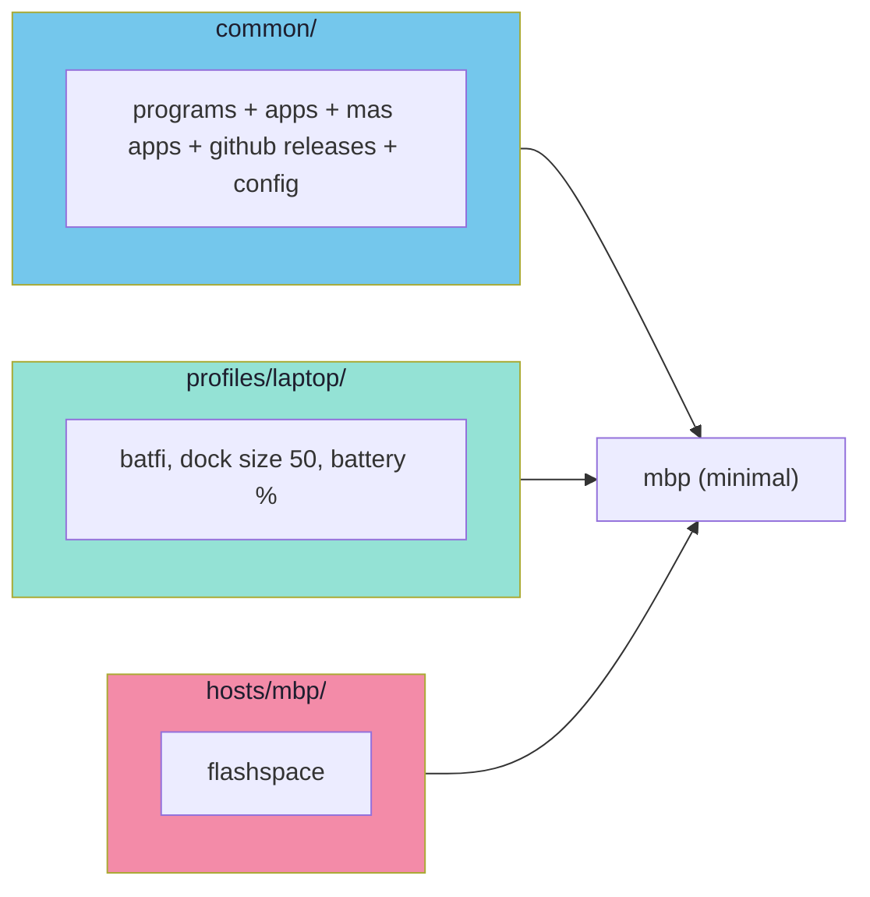
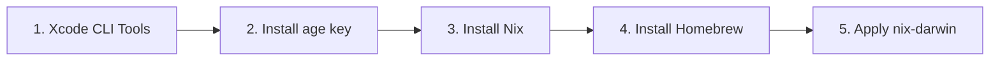

# Architecture

## How Layers Work

Configuration is built from layers that **merge together** — each machine opts into the layers it needs:



| Color | Layer | Applied to |
|---|---|---|
| 🔷 Cyan | `common/` | All machines |
| 🟢 Teal | `profiles/laptop/` | Laptops (mbp) |
| 🟤 Brown | `profiles/work/` | Machines used for work |
| 🔴 Pink | `hosts/{machine}/` | This specific machine only |

Defined in `flake.nix`:

```nix
"mac-desktop" = { profiles = [ "work" ];    };
"mbp"         = { profiles = [ "laptop" ]; };  # minimal
```

---

## Directory Structure

```
nix-config/
├── flake.nix                       # Entry point — defines hosts + profiles
├── Makefile                        # Build commands
│
├── common/                         # Applied to ALL machines
│   ├── homebrew.nix                #   casks, brews, mas apps (18 App Store apps)
│   ├── nix-packages.nix            #   CLI tools + nerd fonts
│   ├── home-manager.nix            #   programs.git, ssh, bat, delta, ghostty, wezterm, karabiner, BetterAudio, Recordly, sdkman
│   ├── system-defaults.nix         #   macOS settings (dock, finder, keyboard)
│   └── programs/                   #   shell & tool configs
│       ├── fish/                   #     fish shell functions & abbreviations
│       ├── atuin.nix               #     shell history (Catppuccin theme)
│       ├── mise.nix                #     runtime version manager (go, node, rust, etc.)
│       └── fastfetch.nix           #     system info display
│
├── profiles/                       # Opt-in feature sets
│   ├── laptop/                     #   Shared laptop settings
│   │   ├── homebrew.nix            #     batfi
│   │   └── system-defaults.nix     #     dock size 50, battery %
│   └── work/                       #   Generic work setup
│       ├── homebrew.nix            #     bloom, tableplus
│       ├── home-manager.nix        #     work folder, shared flashspace configs
│       ├── system-defaults.nix     #     Bloom in dock
│       └── dotfiles/               #     flashspace/settings.json
│
├── hosts/                          # Per-machine unique config
│   ├── mac-desktop/                #   bettermouse, bettertouchtool, betterdisplay, Switor, flashspace profiles
│   └── mbp/                        #   flashspace (different configs)
│
├── shells/                         # nix develop environments
│   ├── postgres.nix                #   PostgreSQL 17 with helper CLIs
│   ├── redis.nix                   #   Redis with port selection
│   └── sops.nix                    #   Age/SOPS secrets tooling
│
├── scripts/                        # Bootstrap scripts
│   ├── setup-nix.sh                #   Xcode + Nix + Homebrew
│   ├── install-desktop.sh
│   └── install-mbp.sh
│
├── secrets/                        # Encrypted SSH keys (sops-nix + age)
│
└── docs/                           # Documentation
```

---

## What's in Common

Everything in `common/` is installed on **all three machines**.

<details>
<summary>Nix packages</summary>

**Home-manager programs** (installed + configured via nix)

| Program | Purpose |
|---|---|
| programs.git | Version control (with gitdir-based work identity) |
| programs.delta | Diff pager (Catppuccin theme, auto-wired to git) |
| programs.bat | `cat` with syntax highlighting (Catppuccin theme) |
| programs.ssh | SSH config (GitHub keys, OrbStack, known_hosts) |
| programs.ghostty | Terminal emulator config (installed via homebrew) |
| programs.wezterm | Terminal emulator config (installed via homebrew) |
| programs.atuin | Shell history with sync |
| programs.mise | Runtime version manager (go, node, rust, erlang, etc.) |
| programs.fish | Shell config (tide, functions, abbreviations) |

**Nix packages** (CLI tools)

| Package | Purpose |
|---|---|
| fastfetch | System info display |
| fd | Better `find` |
| fzf | Fuzzy finder |
| lazygit | Git TUI |
| lsd | Better `ls` |
| vim | Text editor |
| ripgrep | Fast grep |
| age | File encryption |
| curl | HTTP client |
| openssl | TLS/SSL toolkit |
| sops | Secrets manager |
| wget | File downloader |
| yarn | JS package manager |

**Fish plugins**

| Plugin | Purpose |
|---|---|
| tide | Prompt theme |
| sponge | Clean failed commands from history |
| z | Directory jump by frecency |
| done | Notification when long commands finish |
| forgit | Interactive git with fzf |
| colored-man-pages | Colorized man pages |
| sdkman-for-fish | SDKMAN integration |

**Fonts** (Nerd Font variants)

JetBrains Mono · Hack · BlexMono · iM Writing

</details>

<details>
<summary>Homebrew casks</summary>

**Browsers**

| App | Purpose |
|---|---|
| brave-browser | Primary browser |
| google-chrome | Chrome |
| google-chrome@beta | Chrome Beta |

**Terminal & Editor**

| App | Purpose |
|---|---|
| ghostty | Terminal emulator |
| wezterm | Terminal emulator |
| visual-studio-code | Code editor |

**Dev Tools**

| App | Purpose |
|---|---|
| bruno | API client |
| cmux | tmux session manager |
| mockoon | API mocking |
| orbstack | Docker / Linux VMs |

**Productivity**

| App | Purpose |
|---|---|
| flashspace | Virtual workspaces |
| hammerspoon | macOS automation |
| homerow | Keyboard-driven UI navigation |
| obsidian | Note-taking |
| raycast | App launcher |
| rectangle-pro | Window manager |
| rocket | Emoji picker |
| shottr | Screenshot tool |

**Media**

| App | Purpose |
|---|---|
| iina | Video player |
| vlc | Media player |

**System & Utilities**

| App | Purpose |
|---|---|
| appcleaner | App uninstaller |
| discord | Chat |
| jordanbaird-ice | Menu bar manager |
| karabiner-elements | Keyboard remapping |
| keka | File archiver |
| zoom | Video calls |

</details>

<details>
<summary>Mac App Store apps</summary>

**Productivity**

| App | Purpose |
|---|---|
| Amphetamine | Keep display awake |
| Fantastical | Calendar |
| Flow | Focus / Pomodoro timer |
| PastePal | Clipboard manager |
| Presentify | Presentation annotations |
| Spokenly | Text to speech |

**System & Menu Bar**

| App | Purpose |
|---|---|
| BarMarks | Menu bar bookmarks |
| Folder Quick Look | Quick Look for folders |
| iStat Menus | System monitor |
| OpenIn | Default browser / app picker |
| rcmd | App switcher via right ⌘ |

**Notes, Code & Drawing**

| App | Purpose |
|---|---|
| ExcalidrawZ | Diagramming |
| SnippetsLab | Code snippets manager |

**Files & Media**

| App | Purpose |
|---|---|
| DaisyDisk | Disk usage analyzer |
| LilyView | Image viewer |
| Numbers | Spreadsheet |
| PDF Expert | PDF editor |
| Spark | Email client |

</details>

<details>
<summary>Apps installed from GitHub Releases (auto-updated)</summary>

Installed via activation scripts. On every `darwin-rebuild`, the GitHub API is queried for the latest **stable** release — pre-releases are skipped, and the download only runs if a newer version is available.

| App | Repo |
|---|---|
| BetterAudio | [rokartur/BetterAudio](https://github.com/rokartur/BetterAudio/releases) |
| Recordly | [webadderallorg/Recordly](https://github.com/webadderallorg/Recordly/releases) |

</details>

---

## What's in Each Profile

### `profiles/work/`

| What | Detail |
|---|---|
| Casks | bloom, tableplus |
| Dotfiles | flashspace settings |
| Fish | `work` → `cd ~/work` |
| System | Bloom pinned in dock |

### `profiles/laptop/`

| What | Detail |
|---|---|
| Casks | batfi |
| System | dock size 50, battery % shown |

---

## What's in Each Host

### `hosts/mac-desktop/`

| What | Detail |
|---|---|
| Casks | bettermouse, bettertouchtool, betterdisplay |
| Apps | Switor (bundled) |
| Config | flashspace profiles (Obsidian), Switor config |
| Dock size | 65 |
| Battery % | Hidden (always plugged in) |

### `hosts/mbp/`

| What | Detail |
|---|---|
| Config | flashspace (personal only) |

---

## Per-Machine Config Flow

### mac-desktop — `profiles = ["work"]`



### mbp — `profiles = ["laptop"]`

Minimal — common + laptop + host:



---

## Installation Flow



Run `make install-desktop` or `make install-mbp` to execute all steps.

> Place your age key at `secrets/age/keys.txt` before running install. See [Secrets Management](secrets-management.md#setting-up-on-a-new-machine) for details.
