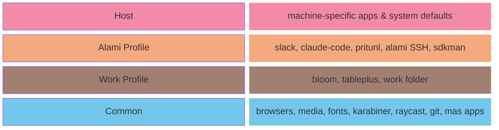
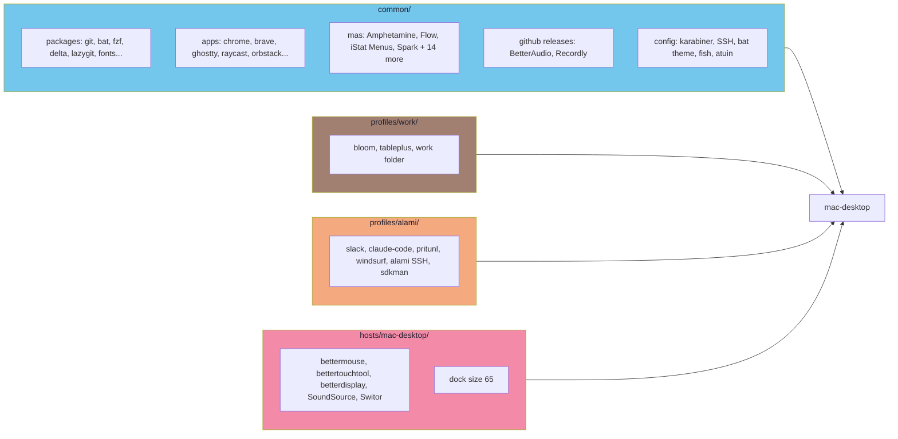
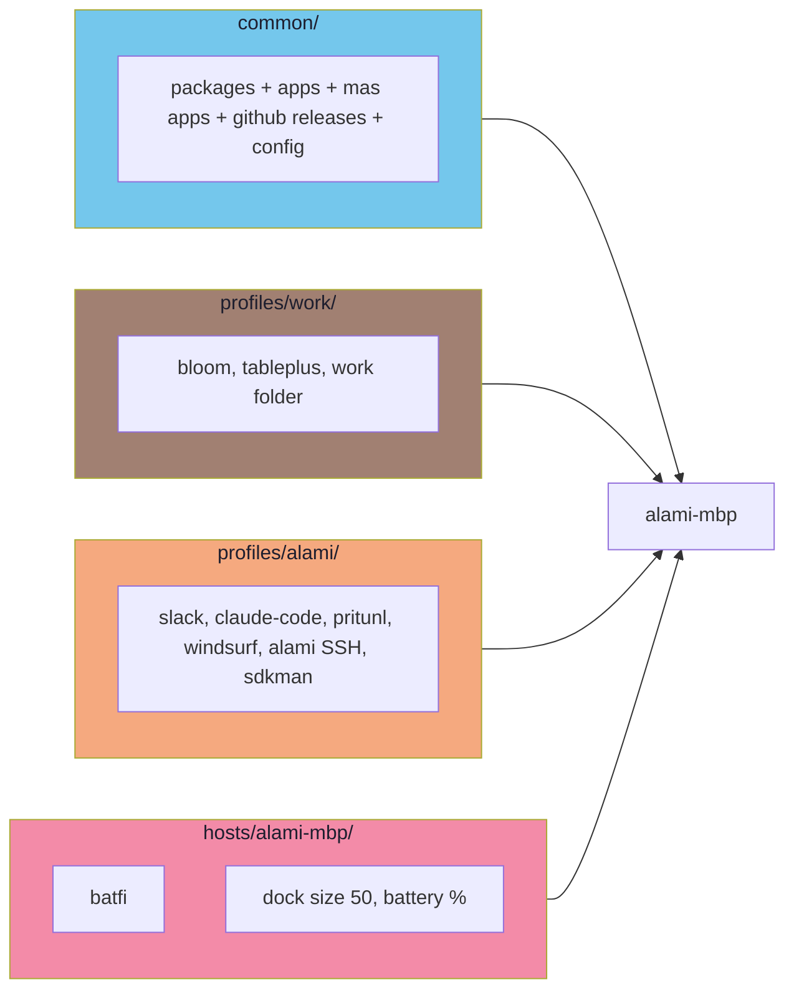
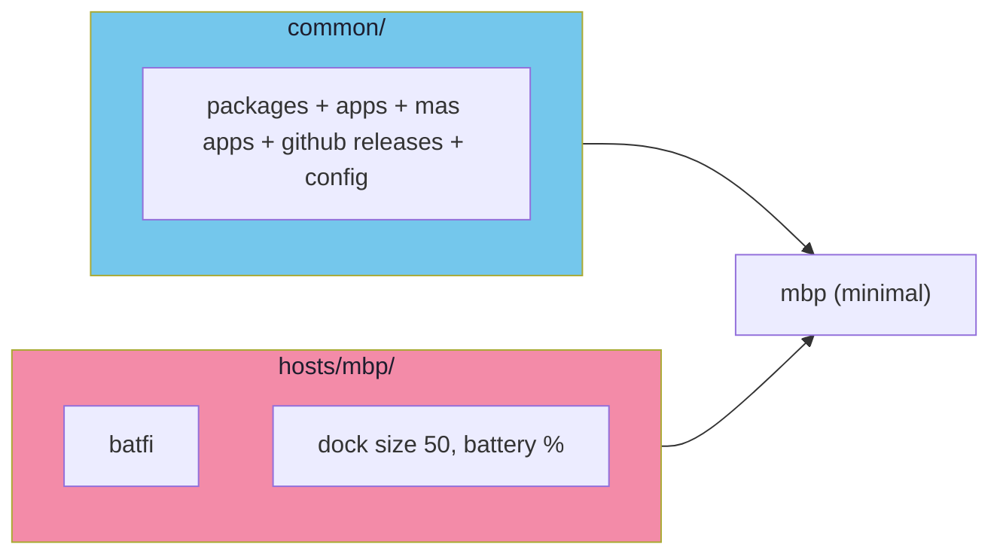
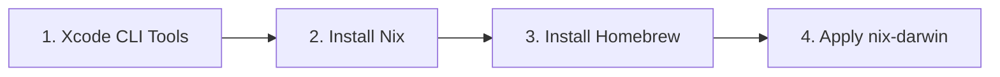

# Architecture

## How Layers Work

Configuration is built from layers that **merge together** — each machine opts into the layers it needs:



| Color | Layer | Applied to |
|---|---|---|
| 🔷 Cyan | `common/` | All machines |
| 🟤 Brown | `profiles/work/` | Machines used for work |
| 🟠 Peach | `profiles/alami/` | Machines for Alami job |
| 🔴 Pink | `hosts/{machine}/` | This specific machine only |

Defined in `flake.nix`:

```nix
"mac-desktop" = { profiles = [ "work" "alami" ]; };
"alami-mbp"   = { profiles = [ "work" "alami" ]; };
"mbp"         = { profiles = [];                 };  # minimal
```

---

## Directory Structure

```
nix-config/
├── flake.nix                       # Entry point — defines hosts + profiles
├── Makefile                        # Build commands
│
├── common/                         # Applied to ALL machines
│   ├── homebrew.nix                #   casks, brews, mas apps (18 App Store apps)
│   ├── nix-packages.nix            #   CLI tools + nerd fonts
│   ├── home-manager.nix            #   SSH, karabiner, bat, ghostty, BetterAudio, Recordly
│   ├── system-defaults.nix         #   macOS settings (dock, finder, keyboard)
│   └── programs/                   #   shell & tool configs
│       ├── fish/                   #     fish shell functions & abbreviations
│       ├── atuin.nix               #     shell history (Catppuccin theme)
│       └── fastfetch.nix           #     system info display
│
├── profiles/                       # Opt-in feature sets
│   ├── work/                       #   Generic work setup
│   │   ├── homebrew.nix            #     bloom, tableplus
│   │   ├── home-manager.nix        #     work folder setup
│   │   └── system-defaults.nix     #     Bloom in dock
│   └── alami/                      #   Alami job-specific
│       ├── homebrew.nix            #     slack, claude-code, pritunl, windsurf, rtk...
│       ├── nix-packages.nix        #     sftpgo, zstd
│       ├── home-manager.nix        #     alami SSH, sdkman, sftpgo config
│       └── fish/                   #     alami-specific functions & abbreviations
│
├── hosts/                          # Per-machine unique config
│   ├── mac-desktop/                #   bettermouse, bettertouchtool, betterdisplay, SoundSource, Switor
│   ├── mbp/                        #   batfi
│   └── alami-mbp/                  #   batfi
│
├── shells/                         # nix develop environments
│   ├── postgres.nix                #   PostgreSQL 17 with helper CLIs
│   ├── redis.nix                   #   Redis with port selection
│   └── sops.nix                    #   Age/SOPS secrets tooling
│
├── scripts/                        # Bootstrap scripts
│   ├── setup-nix.sh                #   Xcode + Nix + Homebrew
│   ├── install-desktop.sh
│   ├── install-mbp.sh
│   └── install-alami.sh
│
├── secrets/                        # Encrypted SSH keys (sops-nix + age)
│
└── docs/                           # Documentation
```

---

## What's in Common

Everything in `common/` is installed on **all three machines**.

<details>
<summary>Nix packages (CLI tools)</summary>

age, atuin, bat, curl, delta, fastfetch, fd, fzf, git, lazygit, lsd, openssl, ripgrep, sops, vim, wget, yarn

Fish plugins: tide, sponge, z, done, forgit, colored-man-pages, sdkman-for-fish

Fonts: JetBrains Mono, Hack, BlexMono, iM Writing (all Nerd Font variants)

</details>

<details>
<summary>Homebrew casks (GUI apps)</summary>

appcleaner, brave-browser, bruno, cmux, discord, flashspace, ghostty, google-chrome, google-chrome@beta, hammerspoon, homerow, iina, jordanbaird-ice, karabiner-elements, keka, mockoon, obsidian, orbstack, raycast, rectangle-pro, rocket, shottr, visual-studio-code, vlc, wezterm, zoom

</details>

<details>
<summary>Mac App Store apps (mas)</summary>

Amphetamine, BarMarks, DaisyDisk, ExcalidrawZ, Fantastical, Flow, Folder Quick Look, iStat Menus, LilyView, Numbers, OpenIn, PastePal, PDF Expert, Presentify, rcmd, SnippetsLab, Spark, Spokenly

</details>

<details>
<summary>Apps installed from GitHub Releases (auto-updated)</summary>

These are downloaded and installed via activation scripts. On every `darwin-rebuild`, the script queries the GitHub API for the latest stable release and only downloads if a newer version is available.

- **BetterAudio** — [rokartur/BetterAudio](https://github.com/rokartur/BetterAudio/releases)
- **Recordly** — [webadderallorg/Recordly](https://github.com/webadderallorg/Recordly/releases)

</details>

---

## Per-Machine Config Flow

### mac-desktop — `profiles = ["work", "alami"]`



### alami-mbp — `profiles = ["work", "alami"]`

Same profiles as mac-desktop, different host config:



### mbp — `profiles = []`

Minimal — only common + host:



---

## Installation Flow



Run `make install-desktop`, `make install-mbp`, or `make install-alami` to execute all steps.
