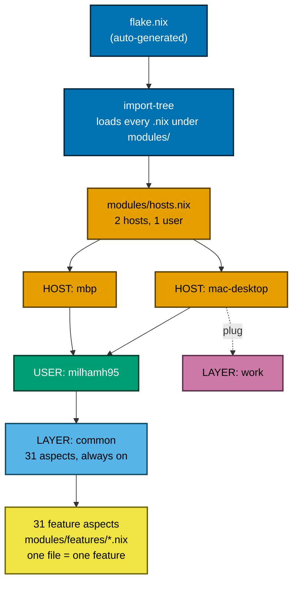
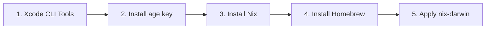

# Architecture

Built with [den](https://github.com/denful/den) + [flake-parts](https://flake.parts).
Every `.nix` file under `modules/` is auto-loaded by
[import-tree](https://github.com/denful/import-tree) — no manual `imports`
list to maintain. One file, one feature ("aspect" in den's vocabulary),
usually covering both the system (`darwin`) and user (`homeManager`) side of
that feature in the same place.

## How it fits together



Colours are [Okabe–Ito](https://jfly.uni-koeln.de/color/) (colour-blind safe)
and every box also carries a word label, so colour is never the only signal.

| Colour | Means | Where you edit it |
|---|---|---|
| 🔵 Blue | Entry point | Never by hand — `nix run .#write-flake` regenerates `flake.nix` |
| 🟠 Orange | A machine | `modules/hosts/<name>.nix` |
| 🟢 Green | The person | `modules/users/milhamh95.nix` |
| 🔷 Light blue | Always-on layer | `modules/layers/common.nix` |
| 🩷 Pink | Optional, pluggable layer | `modules/layers/work.nix` |
| 🟡 Yellow | A single feature | `modules/features/*.nix` |

**Plugging/unplugging a layer** is one line, on the host that owns it:

```nix
# modules/hosts/mac-desktop.nix
den.aspects.mac-desktop.provides.to-users.includes = [ den.aspects.work ];
```

Delete that line and `mac-desktop` no longer gets the `work` layer. `common`
has no such line — every host always gets it.

---

## Directory structure

```
nix-config/
├── flake.nix                    # DO-NOT-EDIT — generated by `nix run .#write-flake`
├── Makefile                     # install / switch / check / secrets commands
│
├── modules/                     # everything den/import-tree loads
│   ├── den.nix                  #   imports den's flakeModule
│   ├── dendritic.nix            #   imports flake-file + den's dendritic module
│   ├── defaults.nix             #   den.default.* — applies to every host/user
│   ├── lib.nix                  #   flake.lib.dotfile — shared home.file helper
│   ├── checks.nix               #   registers both hosts as real `nix flake check` targets
│   ├── hosts.nix                #   declares the 2 hosts + 1 user
│   ├── diagrams.nix             #   `nix run .#write-diagrams` → docs/diagrams/den/*.md + docs/den.md
│   │
│   ├── hosts/                   # per-machine config
│   │   ├── mbp.nix              #   dock size, battery %, batfi
│   │   └── mac-desktop.nix      #   bettermouse/bettertouchtool/betterdisplay, Switor, plugs `work`
│   │
│   ├── users/
│   │   └── milhamh95.nix        #   the one user — shell, primary-user, includes `common`
│   │
│   ├── layers/                  # pluggable role layers
│   │   ├── common.nix           #   always on — lists all 31 aspects every host gets
│   │   └── work.nix             #   ~/work folder, Bloom, TablePlus (mac-desktop only)
│   │
│   ├── features/                # one file = one feature (31 files)
│   │   ├── personal-folder.nix  #   ~/personal folder — every host, part of common
│   │   ├── git.nix, fish.nix, fish-abbr.nix, fish-functions.nix,
│   │   │   fish-git-functions.nix, atuin.nix, bat.nix, ghostty.nix,
│   │   │   wezterm.nix, mise.nix, fastfetch.nix, ssh.nix, sops.nix, ...
│   │   ├── system-defaults.nix  #   macOS dock/finder/keyboard settings
│   │   ├── homebrew-engine.nix  #   the shared brew engine (casks live with their feature)
│   │   ├── mas.nix              #   16 Mac App Store apps
│   │   ├── better-audio.nix,
│   │   │   recordly.nix         #   GitHub-release apps, auto-update on every switch
│   │   └── ...
│   │
│   └── dev/                     # perSystem dev shells (not per-host)
│       ├── default-shell.nix    #   `nix develop` — postgres + redis tools
│       ├── postgres.nix         #   `nix develop .#postgres`
│       ├── redis.nix            #   `nix develop .#redis`
│       └── sops.nix             #   `nix develop .#sops`
│
├── dotfiles/                    # raw config files referenced by modules/
│   ├── <feature>/               #   shared across both hosts (git, bat, atuin, ...)
│   ├── mbp/                     #   mbp-only (flashspace, kickapp)
│   ├── mac-desktop/              #   mac-desktop-only (flashspace, kickapp, switor)
│   ├── work/                     #   (folder kept for future work-only dotfiles)
│   └── manual/                   #   licence/setup notes for apps Nix doesn't manage
│
├── scripts/                     # bootstrap + rebuild
│   ├── install.sh               #   curl-pipeable bootstrap for a fresh Mac
│   ├── setup-nix.sh             #   Xcode CLI Tools + Nix + Homebrew + age key
│   ├── install-desktop.sh, install-mbp.sh
│   ├── switch.sh                #   daily rebuild, auto-detects host
│   └── setup-secrets.sh         #   encrypt secrets/raw/ with sops
│
├── secrets/                     # sops-nix encrypted secrets (age)
│
└── docs/                        # this folder
```

Every dotfile path in `modules/` uses `inputs.self + "/dotfiles/..."`, never
a relative `./dotfiles/...` — relative paths break the moment a file moves.

---

## What every host gets — `common`

`modules/layers/common.nix` lists 29 aspects, always applied to both hosts.
Grouped by what they do:

<details>
<summary>Shell &amp; terminal</summary>

| Aspect | What it gives you |
|---|---|
| `fish` | Shell config (Tide prompt, Fisher plugins, fzf/mise integration) |
| `fish-abbr` | Shell abbreviations (git shortcuts, dev-shell launchers, ...) |
| `fish-functions` | `mkcd`, `fcd`, `fkill`, `gsync` |
| `fish-git-functions` | `fgl`/`fgs`/`fga`/`fgb`/`fgbd`/`fgbdr`/`fgbc` — fuzzy git, colour-blind-safe delta theme |
| `atuin` | Shell history sync (Catppuccin theme) |
| `fastfetch` | System info banner |
| `mise` | Runtime version manager (go, node, rust, erlang, elixir, bun, deno, ...) |
| `ghostty`, `wezterm` | Terminal emulators |
| `bat` | `cat` replacement, Catppuccin theme |

</details>

<details>
<summary>Dev &amp; git</summary>

| Aspect | What it gives you |
|---|---|
| `git` | `programs.git` + `programs.delta`, Catppuccin theme |
| `sops` | sops-nix secrets — `id_github_personal`, gated by `NIX_SKIP_SECRETS` |
| `ssh` | GitHub key config, OrbStack SSH include |
| `sdkman` | Java/Maven via SDKMAN, auto-installs pinned versions |
| `api-tools` | Bruno, Mockoon |

</details>

<details>
<summary>Window &amp; desktop</summary>

| Aspect | What it gives you |
|---|---|
| `window-tools` | Rectangle Pro, Homerow, Hammerspoon, Ice |
| `flashspace` | Virtual workspaces (per-host profile/settings — see below) |
| `kickapp` | App-switcher bundle (per-host config — see below) |
| `karabiner` | Keyboard remapping |
| `homebrew-engine` | The shared brew engine — `bash`, `mas`, `mole`, auto-update on activation |
| `activation-fix` | GNU `readlink`/`install` shim, needed for home-manager's launchd module on macOS |
| `personal-folder` | Creates `~/personal` on every host, no plug needed |

</details>

<details>
<summary>Apps</summary>

| Aspect | Installs |
|---|---|
| `browsers` | Brave, Chrome, Chrome Beta |
| `desktop` | AppCleaner, Keka, Rocket, Raycast, Discord, Zoom, Obsidian, cmux, VS Code, OrbStack |
| `media` | IINA, VLC |
| `mas` | 16 Mac App Store apps (Amphetamine, Fantastical, Flow, PastePal, Spark, iStat Menus, ...) |
| `shottr` | Screenshot tool |
| `better-audio`, `recordly` | Installed straight from GitHub Releases — every `darwin-rebuild` checks for a newer stable tag and updates in place |

</details>

<details>
<summary>System</summary>

| Aspect | What it gives you |
|---|---|
| `system-defaults` | Dock, Finder, keyboard, trackpad, accessibility macOS defaults |

</details>

---

## What's different per host

Both hosts share everything above. This is the part that differs.

### `mbp` — personal laptop

| What | Detail |
|---|---|
| Plugs | none — `~/personal` now comes from `common`, on every host |
| Casks | `batfi` (battery menu bar) |
| System | Dock tile size 65, battery % **shown** |
| Dotfiles | Its own flashspace profiles/settings, KickApp config (`dotfiles/mbp/`) |

### `mac-desktop` — main desktop

| What | Detail |
|---|---|
| Plugs | `work` layer → creates `~/work`, Bloom + TablePlus, Bloom pinned in dock |
| Casks | `bettermouse`, `bettertouchtool`, `betterdisplay` |
| System | Battery % **hidden** (always plugged in) |
| Dotfiles | Its own flashspace profiles/settings, KickApp config, Switor config + app bundle (`dotfiles/mac-desktop/`) |

Adding a 3rd host (e.g. `mbp-office1`) later is 3 steps: one line in
`modules/hosts.nix`, a new `modules/hosts/mbp-office1.nix`, a new
`dotfiles/mbp-office1/` folder. No shared bucket to leak into another host —
see the `work.nix` fix note below.

> **Why flashspace/kickapp/switor live on the host, not the layer:** these
> are physically-tied-to-this-machine files (window layout, installed app
> bundle). They used to live partly inside `layers/work.nix`, which meant
> plugging `work` into a second machine would have silently inherited
> `mac-desktop`'s window layout. Fixed — both now live on
> `modules/hosts/mac-desktop.nix`, next to the aspects that are genuinely
> `mac-desktop`-only.

---

## Dev shells

Not per-host — these are `perSystem` outputs, available on either machine:

```sh
nix develop               # postgres + redis CLI tools
nix develop .#postgres    # PostgreSQL 17, port picker (pgshell abbreviation)
nix develop .#redis       # Redis, port picker (rdshell abbreviation)
nix develop .#sops        # age/sops key + encrypt/decrypt helpers
```

---

## Installation flow



Run `make install-desktop` or `make install-mbp` to execute all steps.
Add `-nosecrets` to either (`make install-mbp-nosecrets`) to skip step 2 and
the sops decryption entirely — no age key needed, useful for cloning this
repo without access to the real secrets. See
[Secrets Management](secrets-management.md#setting-up-on-a-new-machine) for
details.
