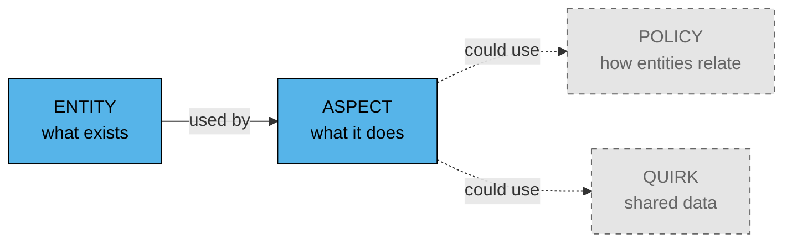
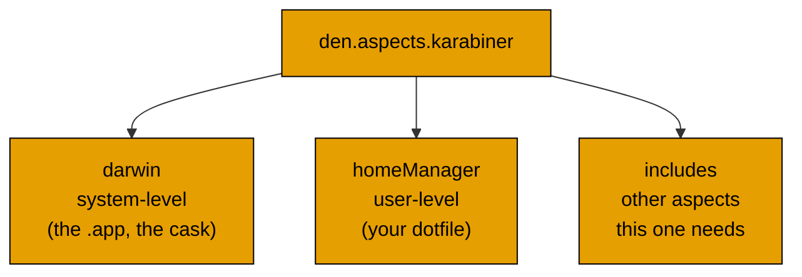
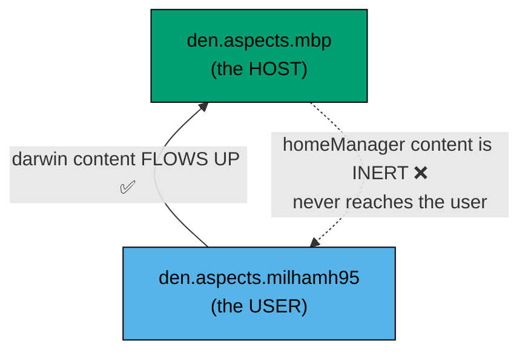
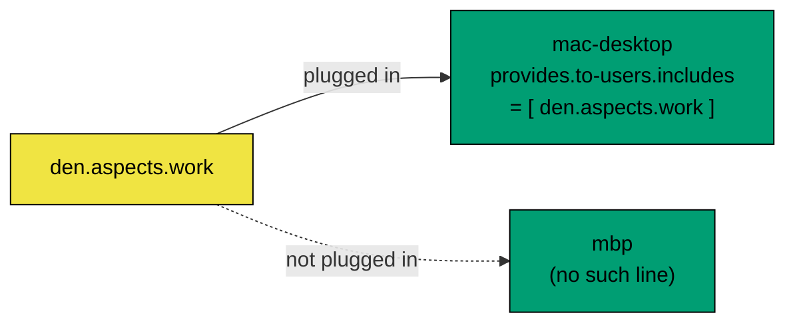
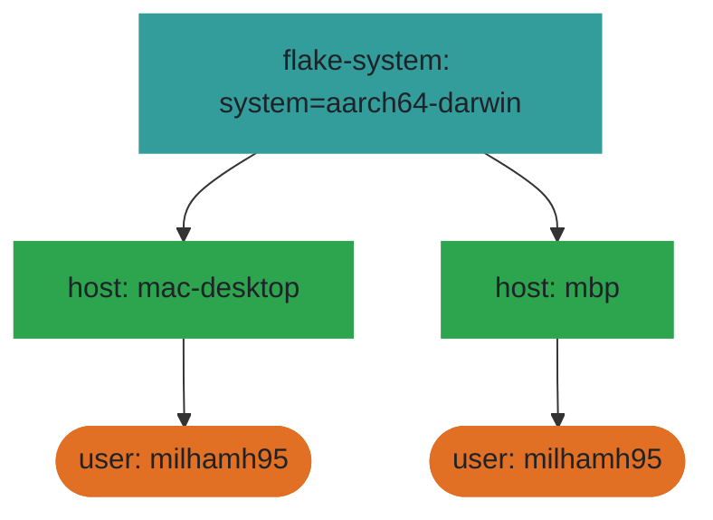
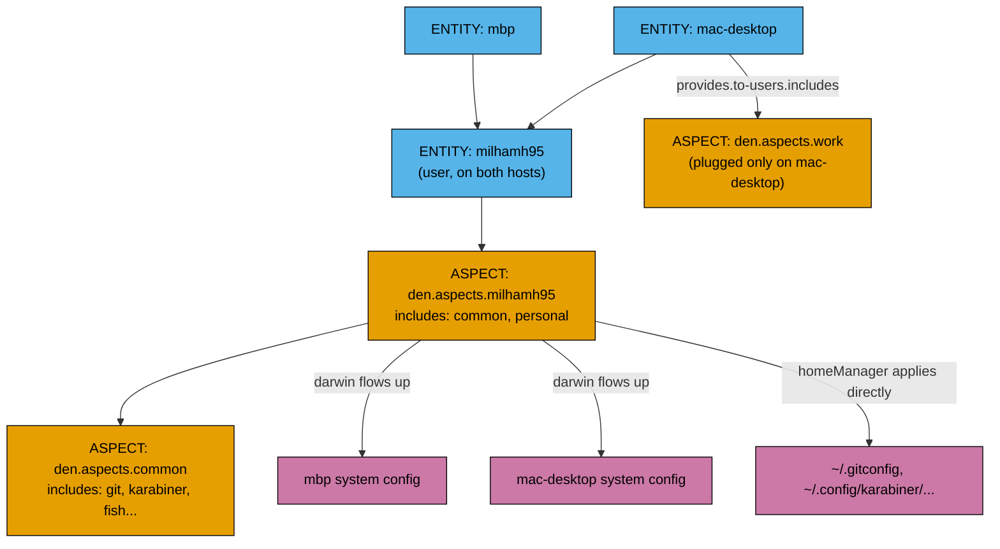

# Den, explained with this repo's own files

**Read time: ~10 min.** Every example below is a real file in this repo, not a made-up sample.

---

## 0. The one idea

A feature is a **function**, not a folder.

```nix
# modules/features/git.nix (real file in this repo)
den.aspects.git = {
  darwin.homebrew.brews = [ "gh" ];   # system side
  homeManager.programs.git.enable = true;  # user side
};
```

One file. Both sides of "install git" — the Homebrew package **and** your `~/.gitconfig`. Old-style nix-darwin makes you split this across two files (a system module, a home-manager module) and wire them together by hand. Den doesn't.

---

## 1. The 4 concepts

Den has 4 building blocks. This repo uses 2 of them. That's fine — the other 2 solve problems you don't have yet.



| Concept | Plain words | This repo | Status |
|---|---|---|---|
| **Entity** | a machine, a user | `mbp`, `mac-desktop`, `milhamh95` | ✅ used |
| **Aspect** | a feature (function) | `git`, `karabiner`, `work` | ✅ used |
| **Policy** | custom routing rules | — | ⬜ not used, built-in routing is enough |
| **Quirk** | many aspects → one shared value | — | ⬜ not used, no fan-in case yet |

---

## 2. Entity — "what exists"

An entity is just data. A record saying "this machine exists" or "this user exists." No behavior.

```nix
# modules/hosts.nix (real file)
den.hosts.aarch64-darwin = {
  mbp.users.milhamh95         = { };
  mac-desktop.users.milhamh95 = { };
};
```

3 lines. That declares: 2 machines, both `aarch64-darwin`, both with one user, `milhamh95`.

Den **automatically** turns each entity into an empty aspect with the same name — `den.aspects.mbp`, `den.aspects.mac-desktop`, `den.aspects.milhamh95` all exist the instant you write this, ready for you to fill in.

---

## 3. Aspect — "what it does"

An aspect is a feature. It has up to 3 kinds of content:



Real example — one app, both halves, one file:

```nix
# modules/features/karabiner.nix (real file)
den.aspects.karabiner.darwin.homebrew.casks = [ "karabiner-elements" ];

den.aspects.karabiner.homeManager =
  { lib, ... }:
  {
    home.file.".config/karabiner/karabiner.json" = self.lib.dotfile {
      inherit inputs;
      path = "karabiner/karabiner.json";
      label = "Karabiner config";
    };
    home.activation.configureKarabiner = lib.hm.dag.entryBefore [ "checkLinkTargets" ] ''
      # removes a stale backup file before linking
    '';
  };
```

- `darwin.homebrew.casks` → installs the app via Homebrew
- `homeManager.home.file` → links your config file
- `homeManager.home.activation` → runs a cleanup script

All 3 in one place. Change karabiner, open **one file**.

### `includes` — aspects can contain other aspects

```nix
# modules/layers/common.nix (real file, shortened)
den.aspects.common.includes = [
  den.aspects.git
  den.aspects.karabiner
  den.aspects.fish
  # ... every everyday tool
];
```

`common` isn't a feature itself — it's a **bundle** of features. Any entity that includes `common` gets git, karabiner, fish, and everything else, all at once.

---

## 4. The flow-up rule — the most important diagram in this doc

This is the one thing that makes den worth using over plain nix-darwin. Learn this picture.



**Rule 1 — content on a user aspect flows UP to its host.** Write a cask on `den.aspects.milhamh95.darwin`, and it lands on `mbp` and `mac-desktop` automatically, no extra wiring.

**Rule 2 — content on a host aspect does NOT flow down.** If you write `den.aspects.mac-desktop.homeManager.programs.git.enable = true`, it silently does nothing. No error. It just never reaches your `~/.gitconfig`.

### The real fix this repo uses — `provides.to-users`

When a host genuinely needs to hand something to its user (a host-specific dotfile, a machine-only setting), it must go through `provides.to-users`:

```nix
# modules/layers/work.nix (real file, shortened)
den.aspects.work = {
  darwin.homebrew.casks = [ "bloom" "tableplus" ];  # flows up fine, it's on an aspect
  homeManager = { lib, ... }: {
    home.activation.configureWorkFolder = lib.hm.dag.entryAfter [ "writeBoundary" ] ''
      mkdir -p "$HOME/work"
    '';
  };
};
```

`work` is included **through the user**, not attached to the host directly — that's why its `homeManager` part works. See the plug pattern below for how it gets switched on.

---

## 5. The plug pattern — how `work` turns on/off per machine



`mac-desktop` gets `work`. `mbp` does not — because nothing says so. That's the whole switch: one line, present or absent.

```nix
# modules/hosts/mac-desktop.nix (real file)
den.aspects.mac-desktop.provides.to-users.includes = [ den.aspects.work ];
```

Delete that line → `work` turns off on that machine. No `enable = true/false` flag anywhere — den's rule is: **if you include it, it's on.**

---

## 6. Policy — the concept this repo skips

A policy is a custom rule for **how entities relate** — think "every host automatically gets a user for each person on the team" or "route this config to a 3rd kind of entity, like a VM."

Den already ships a built-in policy: `host → users`. It fires the moment you write `mbp.users.milhamh95 = {}` in `hosts.nix`. You never see it, it just works.

You'd write your **own** policy only if you invented a new *kind* of entity — a fleet, a VM guest, a Linux box alongside your Macs. This repo has 2 Mac hosts and 1 person. The built-in policy already covers that completely.

```nix
# what a custom policy WOULD look like — not in this repo, shown for contrast
den.policies.host-to-vpn-peers = { host, ... }:
  map (peer: policy.resolve.to "vpn-peer" { inherit host peer; })
    host.vpnPeers;
```

**Skip this until you actually add a new entity kind.**

---

## 7. Quirk — the other concept this repo skips

A quirk solves "many aspects need to feed **one shared thing**, without knowing about each other."

Classic example from den's own docs: 5 services each open a firewall port. Instead of every service hard-coding `networking.firewall.allowedTCPPorts`, each service just says "I need port X" and one aspect collects all of them:

```nix
# what a quirk WOULD look like — not in this repo, shown for contrast
den.aspects.nginx.firewall.ports   = [ 80 443 ];
den.aspects.postgres.firewall.ports = [ 5432 ];
# one consumer reads ALL of them, without listing nginx/postgres by name
den.aspects.networking.homeManager = { firewall, ... }: {
  networking.firewall.allowedTCPPorts = map (f: f.ports) firewall;
};
```

This repo has no such case — nothing needs many features to silently merge into one option. **Skip until you do.**

---

## 8. Full picture — how this repo actually resolves

### Generated from the real config

Drawn by [den-diagram](https://github.com/denful/den-diagram). Do not edit
between the markers — `nix run .#write-diagrams` rewrites it. Same diagrams as
standalone files: [scope topology](diagrams/den/scope-topology.md),
[aspect namespace](diagrams/den/namespace.md).

<!-- den-diagram:start -->

**Scope topology** — system → host → user:



<details>
<summary>Aspect namespace — every aspect and what it includes</summary>



</details>
<!-- den-diagram:end -->

```mermaid
graph TD
  aspects([aspects]):::root
  activation_fix[/"activation-fix · shared"\]:::activation_fix_c
  api_tools[/"api-tools · shared"\]:::api_tools_c
  atuin[/"atuin · shared"\]:::atuin_c
  bat[/"bat · shared"\]:::bat_c
  better_audio[/"better-audio · shared"\]:::better_audio_c
  browsers[/"browsers · shared"\]:::browsers_c
  common[/"common · host"\]:::common_c
  desktop[/"desktop · shared"\]:::desktop_c
  fastfetch[/"fastfetch · shared"\]:::fastfetch_c
  fish[/"fish · shared"\]:::fish_c
  fish_abbr[/"fish-abbr · shared"\]:::fish_abbr_c
  fish_functions[/"fish-functions · shared"\]:::fish_functions_c
  fish_git_functions[/"fish-git-functions · shared"\]:::fish_git_functions_c
  flashspace[/"flashspace · shared"\]:::flashspace_c
  ghostty[/"ghostty · shared"\]:::ghostty_c
  git[/"git · shared"\]:::git_c
  homebrew_engine[/"homebrew-engine · shared"\]:::homebrew_engine_c
  karabiner[/"karabiner · shared"\]:::karabiner_c
  kickapp[/"kickapp · shared"\]:::kickapp_c
  mac_desktop[/"mac-desktop · shared"\]:::mac_desktop_c
  mas[/"mas · shared"\]:::mas_c
  mbp[/"mbp · shared"\]:::mbp_c
  media[/"media · shared"\]:::media_c
  milhamh95[/"milhamh95 · host"\]:::milhamh95_c
  mise[/"mise · shared"\]:::mise_c
  nix_gc[/"nix-gc · shared"\]:::nix_gc_c
  nix_packages[/"nix-packages · shared"\]:::nix_packages_c
  personal_folder[/"personal-folder · shared"\]:::personal_folder_c
  recordly[/"recordly · shared"\]:::recordly_c
  shottr[/"shottr · shared"\]:::shottr_c
  sops[/"sops · shared"\]:::sops_c
  ssh[/"ssh · shared"\]:::ssh_c
  system_defaults[/"system-defaults · shared"\]:::system_defaults_c
  wezterm[/"wezterm · shared"\]:::wezterm_c
  window_tools[/"window-tools · shared"\]:::window_tools_c
  work[/"work · shared"\]:::work_c

  aspects --> mac_desktop
  aspects --> mbp
  aspects --> milhamh95
  aspects --> work
  common --> nix_packages
  common --> nix_gc
  common --> system_defaults
  common --> fish
  common --> fish_abbr
  common --> fish_functions
  common --> fish_git_functions
  common --> atuin
  common --> fastfetch
  common --> mise
  common --> ghostty
  common --> bat
  common --> wezterm
  common --> homebrew_engine
  common --> git
  common --> browsers
  common --> api_tools
  common --> window_tools
  common --> media
  common --> desktop
  common --> mas
  common --> sops
  common --> activation_fix
  common --> shottr
  common --> recordly
  common --> karabiner
  common --> better_audio
  common --> flashspace
  common --> kickapp
  common --> ssh
  common --> personal_folder
  milhamh95 --> common

  classDef root fill:#218bff,stroke:#218bff,color:#1f2328,font-weight:bold
  classDef activation_fix_c fill:#e16f24,stroke:#e16f24,color:#1f2328,stroke-width:2px
  classDef api_tools_c fill:#e16f24,stroke:#e16f24,color:#1f2328,stroke-width:2px
  classDef atuin_c fill:#e16f24,stroke:#e16f24,color:#1f2328,stroke-width:2px
  classDef bat_c fill:#e16f24,stroke:#e16f24,color:#1f2328,stroke-width:2px
  classDef better_audio_c fill:#e16f24,stroke:#e16f24,color:#1f2328,stroke-width:2px
  classDef browsers_c fill:#e16f24,stroke:#e16f24,color:#1f2328,stroke-width:2px
  classDef common_c fill:#218bff,stroke:#218bff,color:#1f2328,stroke-width:2px
  classDef desktop_c fill:#e16f24,stroke:#e16f24,color:#1f2328,stroke-width:2px
  classDef fastfetch_c fill:#e16f24,stroke:#e16f24,color:#1f2328,stroke-width:2px
  classDef fish_c fill:#e16f24,stroke:#e16f24,color:#1f2328,stroke-width:2px
  classDef fish_abbr_c fill:#e16f24,stroke:#e16f24,color:#1f2328,stroke-width:2px
  classDef fish_functions_c fill:#e16f24,stroke:#e16f24,color:#1f2328,stroke-width:2px
  classDef fish_git_functions_c fill:#e16f24,stroke:#e16f24,color:#1f2328,stroke-width:2px
  classDef flashspace_c fill:#e16f24,stroke:#e16f24,color:#1f2328,stroke-width:2px
  classDef ghostty_c fill:#e16f24,stroke:#e16f24,color:#1f2328,stroke-width:2px
  classDef git_c fill:#e16f24,stroke:#e16f24,color:#1f2328,stroke-width:2px
  classDef homebrew_engine_c fill:#e16f24,stroke:#e16f24,color:#1f2328,stroke-width:2px
  classDef karabiner_c fill:#e16f24,stroke:#e16f24,color:#1f2328,stroke-width:2px
  classDef kickapp_c fill:#e16f24,stroke:#e16f24,color:#1f2328,stroke-width:2px
  classDef mac_desktop_c fill:#e16f24,stroke:#e16f24,color:#1f2328,stroke-width:2px
  classDef mas_c fill:#e16f24,stroke:#e16f24,color:#1f2328,stroke-width:2px
  classDef mbp_c fill:#e16f24,stroke:#e16f24,color:#1f2328,stroke-width:2px
  classDef media_c fill:#e16f24,stroke:#e16f24,color:#1f2328,stroke-width:2px
  classDef milhamh95_c fill:#218bff,stroke:#218bff,color:#1f2328,stroke-width:2px
  classDef mise_c fill:#e16f24,stroke:#e16f24,color:#1f2328,stroke-width:2px
  classDef nix_gc_c fill:#e16f24,stroke:#e16f24,color:#1f2328,stroke-width:2px
  classDef nix_packages_c fill:#e16f24,stroke:#e16f24,color:#1f2328,stroke-width:2px
  classDef personal_folder_c fill:#e16f24,stroke:#e16f24,color:#1f2328,stroke-width:2px
  classDef recordly_c fill:#e16f24,stroke:#e16f24,color:#1f2328,stroke-width:2px
  classDef shottr_c fill:#e16f24,stroke:#e16f24,color:#1f2328,stroke-width:2px
  classDef sops_c fill:#e16f24,stroke:#e16f24,color:#1f2328,stroke-width:2px
  classDef ssh_c fill:#e16f24,stroke:#e16f24,color:#1f2328,stroke-width:2px
  classDef system_defaults_c fill:#e16f24,stroke:#e16f24,color:#1f2328,stroke-width:2px
  classDef wezterm_c fill:#e16f24,stroke:#e16f24,color:#1f2328,stroke-width:2px
  classDef window_tools_c fill:#e16f24,stroke:#e16f24,color:#1f2328,stroke-width:2px
  classDef work_c fill:#e16f24,stroke:#e16f24,color:#1f2328,stroke-width:2px
```

### Hand-drawn overview



**Read it top to bottom:** entities exist → the user's aspect pulls in `common` → the host plugs in `work` only where it's wanted → everything resolves into real system config and real dotfiles.

---

## 9. Quick reference table

| Question | Answer | Real file |
|---|---|---|
| Where do machines get declared? | `modules/hosts.nix` | entity |
| Where does one feature live? | `modules/features/<name>.nix` | aspect |
| Where do reusable bundles live? | `modules/layers/<name>.nix` | aspect, using `includes` |
| Where does a host turn a layer on? | `modules/hosts/<name>.nix`, `provides.to-users.includes` | plug |
| Why did my `homeManager` setting silently not apply? | It was on a **host** aspect, not a **user** aspect. See section 4. | trap |
| Do I need a policy? | Only if you add a new *kind* of entity (fleet, VM, Linux box) | not yet |
| Do I need a quirk? | Only if many aspects need to merge into one shared option | not yet |

---

## References

- [denful/den](https://github.com/denful/den) — the framework itself
- [den docs: Core Principles](https://den.denful.dev/explanation/core-principles/)
- [den docs: Aspects](https://den.denful.dev/explanation/aspects/)
- [den docs: Policies](https://den.denful.dev/explanation/policies/)
- [den docs: Quirks & Pipes](https://den.denful.dev/explanation/quirks-and-pipes/)
