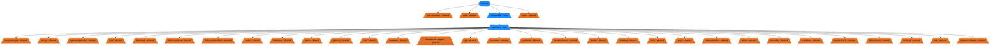

```mermaid
graph TD
  aspects([aspects]):::root
  activation_fix[/"activation-fix · shared"\]:::activation_fix_c
  api_tools[/"api-tools · shared"\]:::api_tools_c
  atuin[/"atuin · shared"\]:::atuin_c
  bat[/"bat · shared"\]:::bat_c
  better_audio[/"better-audio · shared"\]:::better_audio_c
  browsers[/"browsers · shared"\]:::browsers_c
  common[/"common · host"\]:::common_c
  desktop[/"desktop · shared"\]:::desktop_c
  fastfetch[/"fastfetch · shared"\]:::fastfetch_c
  fish[/"fish · shared"\]:::fish_c
  fish_abbr[/"fish-abbr · shared"\]:::fish_abbr_c
  fish_functions[/"fish-functions · shared"\]:::fish_functions_c
  fish_git_functions[/"fish-git-functions · shared"\]:::fish_git_functions_c
  flashspace[/"flashspace · shared"\]:::flashspace_c
  ghostty[/"ghostty · shared"\]:::ghostty_c
  git[/"git · shared"\]:::git_c
  homebrew_engine[/"homebrew-engine · shared"\]:::homebrew_engine_c
  karabiner[/"karabiner · shared"\]:::karabiner_c
  kickapp[/"kickapp · shared"\]:::kickapp_c
  mac_desktop[/"mac-desktop · shared"\]:::mac_desktop_c
  mas[/"mas · shared"\]:::mas_c
  mbp[/"mbp · shared"\]:::mbp_c
  media[/"media · shared"\]:::media_c
  milhamh95[/"milhamh95 · host"\]:::milhamh95_c
  mise[/"mise · shared"\]:::mise_c
  nix_gc[/"nix-gc · shared"\]:::nix_gc_c
  nix_packages[/"nix-packages · shared"\]:::nix_packages_c
  personal_folder[/"personal-folder · shared"\]:::personal_folder_c
  recordly[/"recordly · shared"\]:::recordly_c
  shottr[/"shottr · shared"\]:::shottr_c
  sops[/"sops · shared"\]:::sops_c
  ssh[/"ssh · shared"\]:::ssh_c
  system_defaults[/"system-defaults · shared"\]:::system_defaults_c
  wezterm[/"wezterm · shared"\]:::wezterm_c
  window_tools[/"window-tools · shared"\]:::window_tools_c
  work[/"work · shared"\]:::work_c

  aspects --> mac_desktop
  aspects --> mbp
  aspects --> milhamh95
  aspects --> work
  common --> nix_packages
  common --> nix_gc
  common --> system_defaults
  common --> fish
  common --> fish_abbr
  common --> fish_functions
  common --> fish_git_functions
  common --> atuin
  common --> fastfetch
  common --> mise
  common --> ghostty
  common --> bat
  common --> wezterm
  common --> homebrew_engine
  common --> git
  common --> browsers
  common --> api_tools
  common --> window_tools
  common --> media
  common --> desktop
  common --> mas
  common --> sops
  common --> activation_fix
  common --> shottr
  common --> recordly
  common --> karabiner
  common --> better_audio
  common --> flashspace
  common --> kickapp
  common --> ssh
  common --> personal_folder
  milhamh95 --> common

  classDef root fill:#218bff,stroke:#218bff,color:#1f2328,font-weight:bold
  classDef activation_fix_c fill:#e16f24,stroke:#e16f24,color:#1f2328,stroke-width:2px
  classDef api_tools_c fill:#e16f24,stroke:#e16f24,color:#1f2328,stroke-width:2px
  classDef atuin_c fill:#e16f24,stroke:#e16f24,color:#1f2328,stroke-width:2px
  classDef bat_c fill:#e16f24,stroke:#e16f24,color:#1f2328,stroke-width:2px
  classDef better_audio_c fill:#e16f24,stroke:#e16f24,color:#1f2328,stroke-width:2px
  classDef browsers_c fill:#e16f24,stroke:#e16f24,color:#1f2328,stroke-width:2px
  classDef common_c fill:#218bff,stroke:#218bff,color:#1f2328,stroke-width:2px
  classDef desktop_c fill:#e16f24,stroke:#e16f24,color:#1f2328,stroke-width:2px
  classDef fastfetch_c fill:#e16f24,stroke:#e16f24,color:#1f2328,stroke-width:2px
  classDef fish_c fill:#e16f24,stroke:#e16f24,color:#1f2328,stroke-width:2px
  classDef fish_abbr_c fill:#e16f24,stroke:#e16f24,color:#1f2328,stroke-width:2px
  classDef fish_functions_c fill:#e16f24,stroke:#e16f24,color:#1f2328,stroke-width:2px
  classDef fish_git_functions_c fill:#e16f24,stroke:#e16f24,color:#1f2328,stroke-width:2px
  classDef flashspace_c fill:#e16f24,stroke:#e16f24,color:#1f2328,stroke-width:2px
  classDef ghostty_c fill:#e16f24,stroke:#e16f24,color:#1f2328,stroke-width:2px
  classDef git_c fill:#e16f24,stroke:#e16f24,color:#1f2328,stroke-width:2px
  classDef homebrew_engine_c fill:#e16f24,stroke:#e16f24,color:#1f2328,stroke-width:2px
  classDef karabiner_c fill:#e16f24,stroke:#e16f24,color:#1f2328,stroke-width:2px
  classDef kickapp_c fill:#e16f24,stroke:#e16f24,color:#1f2328,stroke-width:2px
  classDef mac_desktop_c fill:#e16f24,stroke:#e16f24,color:#1f2328,stroke-width:2px
  classDef mas_c fill:#e16f24,stroke:#e16f24,color:#1f2328,stroke-width:2px
  classDef mbp_c fill:#e16f24,stroke:#e16f24,color:#1f2328,stroke-width:2px
  classDef media_c fill:#e16f24,stroke:#e16f24,color:#1f2328,stroke-width:2px
  classDef milhamh95_c fill:#218bff,stroke:#218bff,color:#1f2328,stroke-width:2px
  classDef mise_c fill:#e16f24,stroke:#e16f24,color:#1f2328,stroke-width:2px
  classDef nix_gc_c fill:#e16f24,stroke:#e16f24,color:#1f2328,stroke-width:2px
  classDef nix_packages_c fill:#e16f24,stroke:#e16f24,color:#1f2328,stroke-width:2px
  classDef personal_folder_c fill:#e16f24,stroke:#e16f24,color:#1f2328,stroke-width:2px
  classDef recordly_c fill:#e16f24,stroke:#e16f24,color:#1f2328,stroke-width:2px
  classDef shottr_c fill:#e16f24,stroke:#e16f24,color:#1f2328,stroke-width:2px
  classDef sops_c fill:#e16f24,stroke:#e16f24,color:#1f2328,stroke-width:2px
  classDef ssh_c fill:#e16f24,stroke:#e16f24,color:#1f2328,stroke-width:2px
  classDef system_defaults_c fill:#e16f24,stroke:#e16f24,color:#1f2328,stroke-width:2px
  classDef wezterm_c fill:#e16f24,stroke:#e16f24,color:#1f2328,stroke-width:2px
  classDef window_tools_c fill:#e16f24,stroke:#e16f24,color:#1f2328,stroke-width:2px
  classDef work_c fill:#e16f24,stroke:#e16f24,color:#1f2328,stroke-width:2px
```
