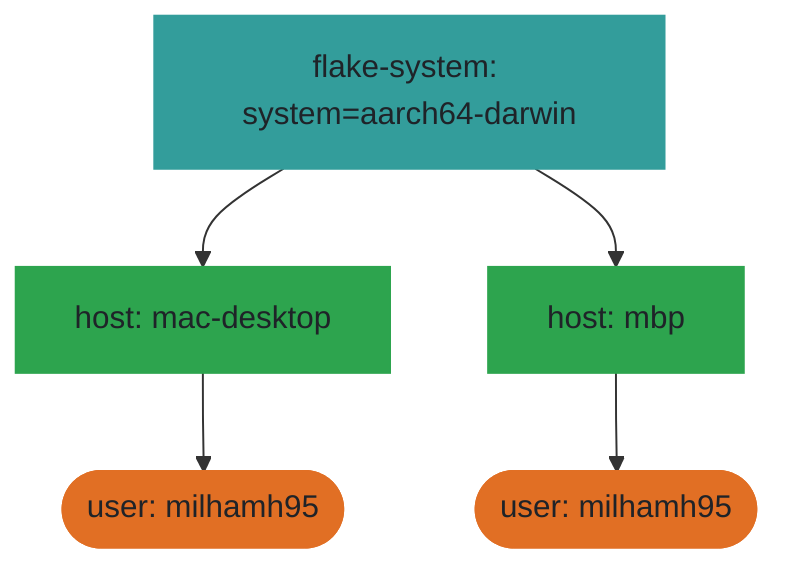

```mermaid
graph TD
  host_mac_desktop_system_aarch64_darwin["host: mac-desktop"]
  host_mac_desktop_system_aarch64_darwin_user_milhamh95(["user: milhamh95"])
  host_mbp_system_aarch64_darwin["host: mbp"]
  host_mbp_system_aarch64_darwin_user_milhamh95(["user: milhamh95"])
  system_aarch64_darwin["flake-system: system=aarch64-darwin"]

  system_aarch64_darwin --> host_mac_desktop_system_aarch64_darwin
  host_mac_desktop_system_aarch64_darwin --> host_mac_desktop_system_aarch64_darwin_user_milhamh95
  system_aarch64_darwin --> host_mbp_system_aarch64_darwin
  host_mbp_system_aarch64_darwin --> host_mbp_system_aarch64_darwin_user_milhamh95

  style host_mac_desktop_system_aarch64_darwin fill:#2da44e,stroke:#2da44e,color:#1f2328
  style host_mac_desktop_system_aarch64_darwin_user_milhamh95 fill:#e16f24,stroke:#e16f24,color:#1f2328
  style host_mbp_system_aarch64_darwin fill:#2da44e,stroke:#2da44e,color:#1f2328
  style host_mbp_system_aarch64_darwin_user_milhamh95 fill:#e16f24,stroke:#e16f24,color:#1f2328
  style system_aarch64_darwin fill:#339D9B,stroke:#339D9B,color:#1f2328
```
