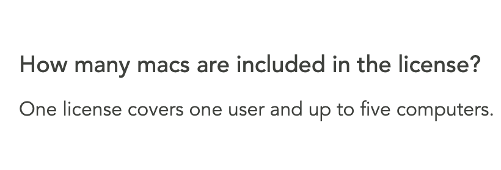
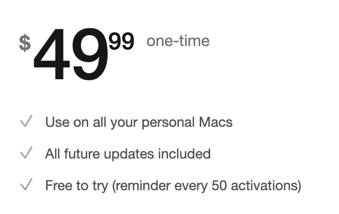
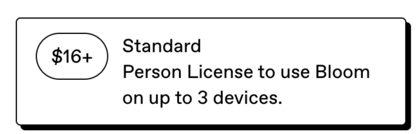
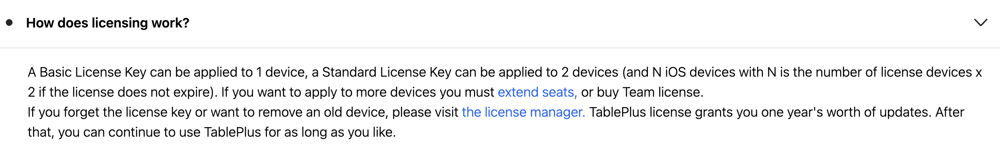

# Paid Apps

License info and device limits for paid apps used in this config.

| App | Devices per License | Link |
|-----|:-------------------:|------|
| [Shottr](https://shottr.cc) | 5 | [FAQ](https://shottr.cc/#faq) |
| [TablePlus](https://tableplus.com) | 2 (Standard) | [Pricing](https://tableplus.com/pricing) |
| [Bloom](https://inchman.gumroad.com/l/Bloom) | 3 (Standard) | [Gumroad](https://inchman.gumroad.com/l/Bloom) |
| [BetterMouse](https://better-mouse.com) | 5 | [Website](https://better-mouse.com) |
| [Homerow](https://www.homerow.app) | Unlimited (personal) | [Website](https://www.homerow.app) |
| [Rectangle Pro](https://rectangleapp.com/pro) | 3 | [Website](https://rectangleapp.com/pro) |

## Shottr

One license covers one user and up to five computers.

License details

## Rectangle Pro

One license can be active on 3 devices at a time.

License details

## Homerow

Use on all your personal Macs, one-time purchase.

License details

## BetterMouse

5 activations per license, one-time purchase.

License details

## Bloom

Standard license to use Bloom on up to 3 devices.

License details

## TablePlus

A Standard License Key can be applied to 2 devices.

License details

