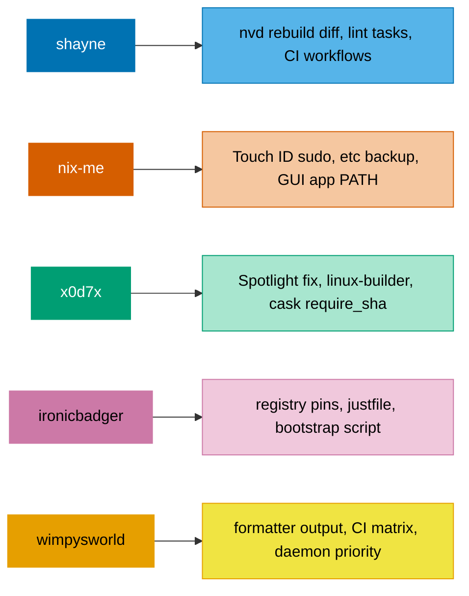

# Full Comparison — 5 nix-darwin Configs

Detailed notes. For the short action list, see [comparison.md](comparison.md).

> **Verdict: keep your structure.**
> `common/` + `profiles/` + `hosts/` with `mkDarwinConfig` is well factored for 2 hosts.
> Your sops-nix secrets and devShells are ahead of most of these repos.
> Everything below is a small addition, not a rewrite.

---

## What Each Repo Is Worth



| Repo | Size | Architecture | Homebrew |
|---|---|---|---|
| shayne | Medium | Auto-discovery from folder names | nix-homebrew + builtin |
| nix-me | Large | 3 layers: shared → machine-type → host | builtin only |
| x0d7x | Small | One host, two platforms | nix-homebrew |
| ironicbadger | Medium | Explicit host list, optional host dirs | nix-homebrew + builtin |
| wimpysworld | Huge | TOML registry + self-gating modules | nix-homebrew + builtin |

---

## 1. shayne/nixos-config

<details>
<summary><b>Architecture</b> — folder names are the config</summary>

Hand-rolled. No flake-parts. `flake.nix` is ~10 lines.

- `systems/<host>/` — creating the folder creates the host
- `home-manager/<user>/<host>/` — creating this folder enrolls that user on that host
- Darwin vs NixOS is decided by whether `darwin-configuration.nix` exists

```nix
isDarwin  = builtins.pathExists (systemsPath + "/${name}/darwin-configuration.nix");
systemFn  = if isDarwin then inputs.nix-darwin.lib.darwinSystem
            else inputs.nixpkgs.lib.nixosSystem;
```

Clever, but buys nothing at 2 hosts and costs readability.
</details>

### Steal

1. **`nvd` rebuild diff** — prints what changed on every switch
2. **`nix.registry` pins** — `nix shell` reuses your locked nixpkgs
3. **`switch_host.sh`** — defaults to `$(hostname -s)`, one command for all machines
4. **`.mise.toml` lint tasks** — `deadnix`, `nixpkgs-fmt`, `statix`
5. **Two CI workflows** — `flake-checker` + auto flake.lock PR twice a week

<details>
<summary>Code</summary>

```nix
system.activationScripts.diff = {
  supportsDryActivation = true;
  text = ''${pkgs.nvd}/bin/nvd --nix-bin-dir=${pkgs.nix}/bin diff /run/current-system "$systemConfig"'';
};
```

```sh
host="${1:-$(hostname -s)}"
nix build ".#darwinConfigurations.${host}.system"
sudo ./result/sw/bin/darwin-rebuild switch --flake "$flake_ref"
```

Also: sops templates rendering a `shell-secrets.fish` sourced by fish; encrypted font tarball decrypted into `~/Library/Fonts`.
</details>

### Skip

- NixOS + Apple Silicon VM bits — irrelevant to you
- `nix.enable = mkForce false` (Determinate installer) — you lose declarative GC
- Stale `stateVersion` values and `permittedInsecurePackages` cruft
- `credential.helper = "store"` — plaintext git tokens

---

## 2. lucamaraschi/nix-me

<details>
<summary><b>Architecture</b> — 3 layers with a machine-type middle</summary>

```text
hosts/types/shared      →  all Macs
hosts/types/macbook     →  laptop settings (trackpad, dock size)
hosts/machines/<host>   →  optional, via builtins.pathExists
extraModules            →  profiles
```

The **machine-type layer** is the idea you do not have. Laptop settings live in one file instead of being repeated per host.

Discipline: `lib.mkDefault` in shared, `lib.mkForce` in the type layer.
</details>

### Steal

1. **Touch ID for sudo** — one line, survives OS updates
2. **`/etc` backup before first switch** — fixes the classic first-run failure
3. **GUI app PATH** — so VS Code and JetBrains find Nix binaries
4. **Add/remove package deltas** — profiles declare only changes, not full lists
5. **Feature flags** — `options.myconfig.work.enable` + `lib.mkIf` instead of import-or-not

<details>
<summary>Code</summary>

```nix
security.pam.services.sudo_local.touchIdAuth = true;
```

```nix
environment.etc."paths.d/nix".text = "/run/current-system/sw/bin";
```

Package deltas:
```nix
homebrew.casks = lib.mkDefault (
  (lib.subtractLists config.apps.casksToRemove config.apps.baseCasks)
  ++ config.apps.casksToAdd);
```

> **Caveat:** they store packages as **strings** and resolve them by name. Do not copy that — it breaks eval-time checking. Keep real `pkgs.foo` values.

Also: `pmset` power policy in an activation script; `homebrew.skipMasApps` option.
</details>

### Skip

- 13 host entries, ~8 are fictional demos that never build
- A TypeScript TUI, shell wizards, a VM test harness, 18 doc files
- `nix.enable = false` with 20 lines of commented-out settings
- Activation script symlinking to a hardcoded `$HOME/src/lm/nix-me`

---

## 3. x0d7x/nix-config

<details>
<summary><b>Architecture</b> — smallest of the five (~15 files)</summary>

One curried builder picks darwin vs NixOS by string interpolation:

```nix
systemFunc = if isDarwin then inputs.nix-darwin.lib.darwinSystem
             else nixpkgs-linux.lib.nixosSystem;
modules = [
  ../hosts/${if isDarwin then "darwin" else "nixos"}/settings.nix
];
```

**No home-manager at all.** Everything is system-level. Your setup is stronger here — you get per-user rollback and `home.file` dotfiles.
</details>

### Steal

1. **Spotlight fix** — Nix GUI apps are symlinks; Spotlight ignores symlinks. `mkalias` makes real aliases.
2. **`nix.linux-builder.enable`** — a local Linux VM so you can build Linux packages from macOS
3. **`nix.channel.enable = false`** — correct on a pure-flakes setup
4. **`homebrew.caskArgs.require_sha = true`** — refuses casks with no checksum
5. **Keep shell config as real files** — `builtins.readFile` them in, so they stay editable and syntax-highlighted

<details>
<summary>Code</summary>

```nix
nix = {
  settings = { experimental-features = [ "nix-command" "flakes" ]; };
} // lib.optionalAttrs isDarwin {
  linux-builder.enable = true;
  channel.enable = false;
};
```

```nix
interactiveShellInit = lib.strings.concatStrings (lib.strings.intersperse "\n" [
  (builtins.readFile ./aliases)
  (builtins.readFile ./func)
]);
```

Applies directly to your `common/programs/fish`.

Also: declarative Dock via `dock.persistent-apps`; `launchd.user.agents` for user daemons.
</details>

### Skip

- Args passed that do not exist in `specialArgs` — copy-paste bugs
- Dead code: commented imports, an entire unused `apps/fish/` tree
- No secrets, no CI, no formatter

---

## 4. ironicbadger/nix-config

<details>
<summary><b>Architecture</b> — explicit and small, host dirs optional</summary>

```nix
mkDarwin = { hostname, username ? "alex", system ? "aarch64-darwin" }:
let
  customConf = if builtins.pathExists ./../hosts/darwin/${hostname}
               then ./../hosts/darwin/${hostname} + "/default.nix"
               else ./../hosts/common/darwin-common-dock.nix;
in inputs.nix-darwin.lib.darwinSystem { ... };
```

Adding a Mac = one line. Closest in spirit to your setup.
</details>

### Steal

1. **Flake registry pins** — `nix shell n#foo` uses your nixpkgs, no download
2. **`justfile` with `hostname -s` default** — replaces every per-host Makefile target
3. **`new-mac-bootstrap` script** — the best single file across all 5 repos
4. **Per-host `lib.mkAfter` on cask lists** — append without redefining
5. **`postActivation` user-defaults wrapper** — some macOS settings must be written as the user, not root

<details>
<summary>Code</summary>

```nix
nix.registry = {
  n.to = { type = "path"; path = inputs.nixpkgs; };
  u.to = { type = "path"; path = inputs.nixpkgs-unstable; };
};
```

```nix
homebrew.casks = lib.mkAfter [ "displaylink" "elgato-stream-deck" ];
```

```sh
user_defaults() {
  launchctl asuser "$preferences_uid" sudo -u "$preferences_user" \
    --set-home /usr/bin/defaults "$@"
}
```

Their bootstrap script handles: sudo pre-check, Xcode CLT, Rosetta, Nix install, clone, build, and safe `/etc/bashrc` backup with an error trap.

Also: `darwin-anti-annoyance.nix`, a tiny opt-in module killing autocorrect and animations — good model for small composable modules.
</details>

### Skip

- Large commented-out cask blocks
- A 290-line single home-manager file
- CI runs `flake-checker` only, never builds
- Overlays inlined in the builder instead of an `overlays/` folder

---

## 5. wimpysworld/nix-config

<details>
<summary><b>Architecture</b> — TOML registry + self-gating modules</summary>

Hosts are **data**, not code. `lib/registry-systems.toml` declares each host with `kind`, `platform`, `formFactor`, `tags`.

```nix
systems = builtins.fromTOML (builtins.readFile ./lib/registry-systems.toml);
darwinConfigurations = builder.mkAllDarwin systems;
```

Host folders are nearly empty — `darwin/momin/default.nix` is literally `_: { }`. All behaviour is gated on tags via a custom options module.

```nix
homebrew.casks = [ "blender" "zed" ]
  ++ lib.optionals config.noughty.host.is.workstation [ "ghostty" ]
  ++ lib.optionals (noughtyLib.isUser [ "martin" ]) [ "docker-desktop" ];
```

Impressive, but built for 10+ machines across 2 operating systems.
</details>

### Steal

1. **Formatter as a flake output** — `deadnix` → `statix` → `treefmt` in one command
2. **`nix.daemonProcessType = "Background"`** — stops audio and UI stutter during builds
3. **`mac-app-util` input** — another route to the Spotlight/Dock fix
4. **`nix-index-database`** — `command-not-found` that actually works
5. **CI matrix** — enumerates flake outputs, then builds each in parallel

<details>
<summary>Code</summary>

```nix
nix.daemonProcessType = "Background";
nix.daemonIOLowPriority = true;
environment.variables.SHELL = "${pkgs.fish}/bin/fish";
```

Auto-import every subfolder (the `_mixins` trick):
```nix
{ lib, ... }:
let
  directories = lib.filterAttrs (n: t: t == "directory" && n != "_template")
    (builtins.readDir ./.);
in { imports = lib.mapAttrsToList (name: _: import (./. + "/${name}")) directories; }
```
</details>

### Skip

- ~40 sops files, a Catppuccin palette JSON with colour helper functions
- Hand-reconstructed flake outputs inside the overlay (30 lines of surgery)
- FlakeHub / Determinate lock-in
- Corporate policy modules (Kolide, Falcon)
- The `_mixins` "import everything" model — every eval loads every module

---

## Verdict On Your Flake

**Keep the structure.** Your `profiles/` layer is an explicit opt-in mechanism that shayne and x0d7x lack entirely — they would have to duplicate config instead.

Three real fixes, in order:

1. **Hosts are listed twice** in `flake.nix`. Fix:
   ```nix
   darwinConfigurations = nixpkgs.lib.mapAttrs (_: mkDarwinConfig) hostConfigs;
   ```
2. **Move `mkDarwinConfig` out of `flake.nix`** into `lib/mkDarwinConfig.nix`. Your flake mixes host data, base config, and the builder in 173 lines.
3. **`mkBaseConfiguration` hardcodes `uid = 501` and `aarch64-darwin`** for all hosts. Fine today. Move to `hostConfigs` if you ever add an Intel Mac or a second user.

---

<details>
<summary><b>Every technique found, ranked</b></summary>

**Tier 1 — do these**

| Technique | From | Effort |
|---|---|---|
| Touch ID sudo | nix-me | 1 line |
| `nvd` rebuild diff | shayne | 5 lines |
| `nix.registry` pins | ironicbadger | 3 lines |
| Dedupe host list | — | 1 line |
| `nix.channel.enable = false` | x0d7x | 1 line |

**Tier 2 — worth doing**

| Technique | From | Effort |
|---|---|---|
| Spotlight `mkalias` fix | x0d7x | ~15 lines, needs testing |
| Formatter flake output | wimpysworld | ~15 lines |
| justfile with hostname default | ironicbadger | ~20 lines |
| `daemonProcessType = "Background"` | wimpysworld | 2 lines |
| `environment.etc."paths.d/nix"` | nix-me | 3 lines |
| `/etc` backup on first switch | nix-me | ~10 lines |
| `caskArgs.require_sha` | x0d7x | 1 line |

**Tier 3 — only if you grow**

- Machine-type layer between common and hosts
- Package add/remove deltas via module options
- Feature flags replacing `profiles/`
- `linux-builder` for cross-building
- CI matrix builds

**Never**

- TOML host registry (needs 10+ hosts)
- Auto-import everything (hurts readability at your size)
- `nix.enable = false` (loses declarative GC)
- Packages stored as strings (breaks eval-time checks)

</details>

<details>
<summary><b>Where the clones live</b></summary>

```text
/Users/milhamh95/nix/reference/
├── shayne-nixos-config
├── nix-me
├── x0d7x-nix-config
├── ironicbadger-nix-config
└── wimpysworld-nix-config
```

Delete when done: `rm -rf /Users/milhamh95/nix/reference`
</details>
